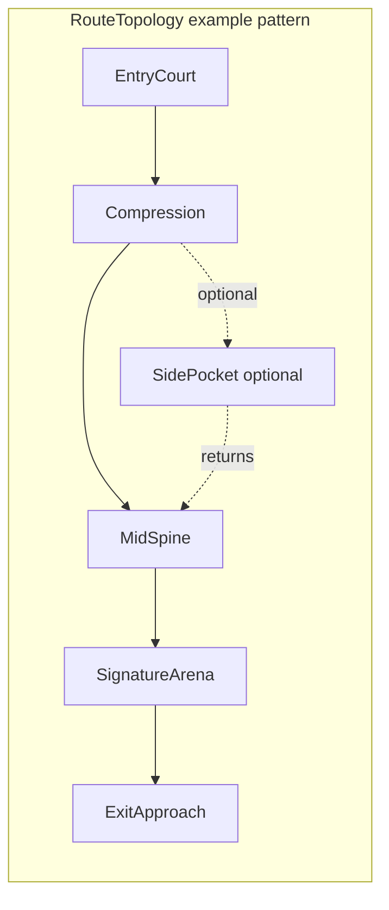
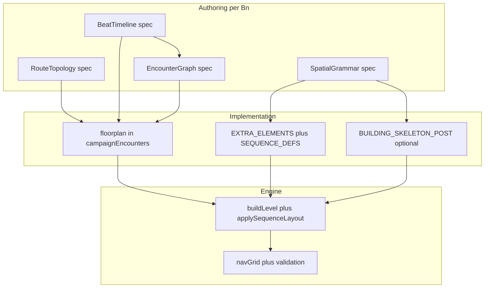

# Twelve fully bespoke levels (complete A–Z per building)

## Intent (what you are building)

Each **level = one campaign building** (B01–B12) is a **complete play experience**, not a large rectangle with three kill bands:

- **Read** (where am I, where is threat, where is exit) must be answered by **architecture + light + audio**, not HUD text.
- **Commitment** (which door, which flank, which vertical path) must be **forced by authored geometry and encounter pressure**, not by enemy count alone.
- **Payoff** (signature room, boss or lieutenant read, mastery or setpiece) must be **recognizable and tied to that building’s fantasy only**.

Today the engine still centers on a **shared spine** ([`buildCellSkeleton`](src/levelSequences.js), zone doors in [`buildLevel`](src/main.js)) and B02–B12 still inherit a **cloned B01 encounter floorplan** via [`_makeGeneratedCampaignEncounter`](src/campaignEncounters.js). That is the root of “open / samey” feel: **data and beats are not yet unique per level**. This plan makes **maps and narratives first-class** before mesh work, then locks implementation to those maps.

---

## Layered “maps” (every level ships all four)

Each `docs/levels/B##_SPEC.md` must contain these **four authored maps**. They are the contract between design and implementation; code changes must trace to a line in the spec.

### 1. Route topology map (player graph)

- **Nodes**: floorplan `spaces[id]` (or interim cell labels FW…BC until floorplan exists).
- **Directed edges**: `exits[]` + `floorplan.transitions` (doorway, zone_door, LOS, drop_read).
- **Mark**: mandatory happy path (`primaryRoutes[]`), optional loops, dead-ends that must justify themselves (loot, read, one-way drop per [LEVELS_PLAN.md](LEVELS_PLAN.md) §3.2).
- **Cross-check**: no edge may violate “no dead end without purpose”; zone doors and spawn-door lanes stay sacred ([`ZONE_Z_SPLIT`](src/main.js), [`alertDoorways`](src/main.js), spawn doors).

ASCII or mermaid is fine; the point is **unambiguous graph** before placing dividers.

### 2. Beat timeline map (tempo / verbs)

Three macro bands + signature, aligned to [LEVELS_PLAN.md](LEVELS_PLAN.md) §4.1 **zone role contract** and §1 **one verb per beat**:

| Segment | Zone index | Design role | Dominant verb | Player fantasy beat |
|---------|------------|-------------|---------------|----------------------|
| Front | 0 | Read, escalate | read / pick_route | “I understand the building” |
| Middle | 1 | Brawl, commit | hold / flank / push | “I pay a cost to rotate” |
| Back | 2 | Signature + cleanup | clear / defend / exfil | “I finish the place” |

Per level, add **one row per 30–90s beat** inside each zone (e.g. “alarm relay hold”, “catwalk reveal”, “reinforcement wave”) with: trigger (zone clear, room enter, alarm), composition intent (roles), and **geometry dependency** (“requires east compression corridor”).

### 3. Encounter graph (AI + director)

- **Nodes**: `encounters[].id` + `room` + `objective` + `completion`.
- **Edges**: `reinforcements` triggers, `director.objectives` (hold_interact, traverse_room, future types), `opensOn` / zone door policy.
- **Spawn binding**: each `authoredSpawns` row → `roomId` / cell / **patrol tag** ([`ENCOUNTER_PATROL_ROUTES`](src/main.js), [`encounterBehavior.js`](src/encounterBehavior.js)) so enemies **use** corridors instead of orbiting center.
- **Cross-check**: reinforcement ingress respects choke geometry (generalize [`_spawnB01AlarmReinforcements`](src/main.js) pattern per building).

### 4. Spatial grammar map (shapes + doors + cover)

Per cell (or per space), tag using [LEVELS_PLAN.md](LEVELS_PLAN.md) §3.1 **four room shapes** (pinch / pocket / spine / atrium) and §3.2 **door types** (public, service, hard, one-way where engine allows).

**Cover grammar** (§3.4): each authored cell must deliberately mix **knee / chest / full** heights—not six identical blocks.

**Sightlines** (§3.3): at least one **off-axis** read per cell where the spec calls for it; first long sightline targets a **hero prop** not a blank wall.

Implementation hooks:

- Shapes → [`SEQUENCE_DEFS[bn].cells`](src/levelSequences.js) element lists + [`EXTRA_ELEMENTS[bn]`](src/levelSequences.js) + optional [`BUILDING_SKELETON_POST[bn]`](src/levelSequences.js).
- Transitions → [`CAMPAIGN_ENCOUNTERS[bn].floorplan`](src/campaignEncounters.js).
- Sub-room kits → [SUBROOM_FLOW_PLAN.md](SUBROOM_FLOW_PLAN.md) (`corridor` / `vestibule` / `dogleg`).

---

## Twelve-building design matrix (anchor to LEVELS_PLAN)

Use this table as the **first fill** in each spec’s “Identity” section; implementation must converge to it (footprint/verticality may be phased).

| bn | Identity | Target footprint (LEVELS_PLAN §2.1) | Vertical layers | Dominant room shapes (sequence) | Signature threshold | Notes |
|----|----------|-------------------------------------|-----------------|-----------------------------------|----------------------|-------|
| 01 | Loading Dock | wide-flat + catwalk | 1 + catwalk | spine → pinch → atrium (cage) | relay cage / foreman read | Gold bar |
| 02 | Continental Lobby | formal | 1 + mezzanine | atrium → pocket → spine | concierge / salon | Mezzanine read |
| 03 | Nightclub | intimate | pit + VIP | pocket → pinch → spine | pit / VIP glass | Low light, LOS |
| 04 | Penthouse | long arc | sunken tier | spine → pocket → pinch | wine / exec suite | Elevation commit |
| 05 | Sterling Medical | corridor grid | roof bridge | spine → pinch → pocket | ICU / surgery | Clinical lanes |
| 06 | Subway Line 7 | long linear | track pit | pinch → spine → pinch | platform / tunnel | Linear pressure |
| 07 | Azure Yacht | narrow deck | deck + cabin | spine → pocket → atrium | bridge / hull read | Diagonal hero wall candidate |
| 08 | Server Farm | grid wide | raised floor | spine → pinch → atrium | hot/cold / core | Glass enfilade |
| 09 | Border Crossing | long sand axis | watchtower | spine → pocket → pinch | customs / tower | Long axis break |
| 10 | Cathedral | nave + loft | choir loft | atrium → pinch → pocket | altar / loft | Vertical sacred |
| 11 | Karelia Freighter | deck spine | engine / bridge | spine → pinch → pocket | engine room / bridge | Industrial narrow |
| 12 | The Spire | helipad run | crown glass | spine → atrium → pinch | helipad apex | Drop / glass |

**Diagonal / curved hero** (LEVELS_PLAN §2.3): at most **one** signature non-axis wall per building; approximate with 6–8 AABB segments so nav stays bakeable.

---

## Level spec document template (required sections)

File: `docs/levels/B##_SPEC.md` (from `LEVEL_SPEC_TEMPLATE.md`).

1. **Logline** — One sentence player fantasy.
2. **Three-second read** — What tells them building + exit direction without UI.
3. **Route topology map** — Graph + mandatory vs optional routes.
4. **Beat timeline** — Table: time/zone/verb/composition/geometry dependency.
5. **Encounter graph** — Encounters, objectives, reinforcements, patrol tags.
6. **Spatial grammar** — Per cell or per space: shape tag, door type, cover mix, sightline notes.
7. **Audio / lighting identity** — Zone or room hooks ([`tickLighting`](src/main.js), `reverbSetBuilding`) within budget.
8. **Mastery / setpiece** — Tie to existing campaign/mastery hooks where applicable.
9. **Acceptance checklist** — Chokes, loop, signature, no softlock, validates green, playtest sign-off.
10. **Traceability table** — Rows: `geometryId` / `requiredGeometry` ↔ `EXTRA_ELEMENTS` / mesh ↔ `floorplan.spaces`.

---

## Current gap (code ground truth)

- Shared **partition skeleton** + **zone doors**; flavor mostly [`SEQUENCE_DEFS[bn]`](src/levelSequences.js) + [`EXTRA_ELEMENTS[bn]`](src/levelSequences.js).
- **B02–B12** [`CAMPAIGN_ENCOUNTERS`](src/campaignEncounters.js) still from **`_makeGeneratedCampaignEncounter`** (B01 clone, stripped `requiredGeometry`) → director and room graph cannot match building fantasy.
- Tooling exists: [SUBROOM_FLOW_PLAN.md](SUBROOM_FLOW_PLAN.md), `validate:campaign`, `validate:geometry`, `__game.debug` floorplan HUD — this plan **uses** them as gates, not as the end goal.

---

## Definition of done (each level)

A building `bn` is **shipped** when:

1. **`B##_SPEC.md` complete** — All template sections + traceability table filled.
2. **Native `CAMPAIGN_ENCOUNTERS[bn]`** — No clone from B01; floorplan matches built geometry; `validate:campaign` passes.
3. **Geometry implements spatial grammar** — Room shapes + door language + cover mix + off-axis sightlines per spec; zone/spawn doors validated (`validate:geometry`, doorway scripts as needed).
4. **Footprint / verticality** — If the matrix row requires different `RW`/`RD` or layers, [`getBuildingDims`](src/main.js) / `floorRegion` / `plat` / stairs implemented for **that bn only** with nav + AI re-check.
5. **Encounters A–Z** — `encounters`, `authoredSpawns`, `director`, patrol routes, behaviors; no generic “fill oval with enemies.”
6. **Polish within budget** — Audio/light slices only where spec lists them; no new PointLight budget violations ([CAMPAIGN_LEVELS_REWORK_PLAN.md](CAMPAIGN_LEVELS_REWORK_PLAN.md) non-goals).
7. **Acceptance** — Spec checklist + automated validates + recorded playtest (date + build hash).

---

## Execution phases

### Phase 0 — Documentation spine

- `docs/levels/README.md` — Index: bn, spec link, status (draft / impl / QA / signed), owner, last playtest.
- `docs/levels/LEVEL_SPEC_TEMPLATE.md` — Full template (sections above).
- `docs/levels/B01_SPEC.md` — **Gold reference**: backfill from current best shipped state so the team has one “complete” example.

### Phase 1 — Remove clone dependency (building by building)

- Introduce `src/campaign/encounters/b02.js` … or inline in `campaignEncounters.js` — explicit `CAMPAIGN_ENCOUNTERS[bn]` for each bn as it is finished.
- Adjust `_makeGeneratedCampaignEncounter` to **skip** any `bn` that already has a full native def (temporary bridge), then **delete** generator when 12/12 native.

### Phase 2 — Plumbing (only where matrix requires)

- Per-bn `RW`/`RD`/`RH` from matrix + LEVELS_PLAN §2.1; audit `ZONE_Z_SPLIT`, `fp`/`zp`, spawns, zone door positions.
- Verticality: `floorRegion`, `plat`, vaultables, catwalk stacks per §2.2; AI/nav follow-ups per LEVELS_PLAN engine notes.

### Phase 3 — Content waves (same order as before, but each step is spec-first)

1. **B01** — Formalize existing work into B01_SPEC (reference bar).
2. **Wave A** — B06, B11 (linear / industrial; stress corridor + validation).
3. **Wave B** — B05, B08 (grid / glass lanes).
4. **Wave C** — B02, B04, B10 (formal / prestige / vertical reads).
5. **Wave D** — B03, B07, B09, B12 (asymmetric / deck / desert / spire).

**Per building workflow (non-negotiable order):** Spec maps (§Layered maps) → review → floorplan JSON → EXTRA / SEQUENCE / skeleton → encounters + spawns → validates → playtest → sign-off.

### Phase 4 — Hardening

- Optional: per-bn `mandatorySpaces[]` in validate script for “must be nav-reachable from at least one spawn.”
- Regression: `test:campaign`, `test:ai`, perf/visual after **each wave**, not only at end.

---

## Anti-patterns (“half-assed open levels”)

| Pattern | Fix |
|---------|-----|
| Clone B01 floorplan for B07 | Native graph + native encounters |
| Only `SEQUENCE_DEFS` props differ | Spatial grammar + topology map drive dividers |
| Middle zone = more enemies | Beat timeline + pinch + elite anchor per LEVELS_PLAN §4.1 |
| All sightlines along Z | Off-axis reads + hero focal props §3.3 |
| One door language everywhere | Mix public / service / hard per §3.2 |

---

## Risks and mitigations

| Risk | Mitigation |
|------|------------|
| Twelve full specs is heavy | Template + B01 gold + wave gates; no code without spec maps |
| Per-bn dims touch many coordinates | One building per PR; always run geometry validate |
| Nav / AI break on new choke | Open zone doors in validate path; multi-spawn flood; reinforcement probe |
| Scope creep (hero wall everywhere) | One non-axis signature per building per §2.3 |
| Doc drift from code | Traceability table mandatory in each spec |

---

## First execution slice (when you approve implementation)

1. Add `docs/levels/README.md`, `LEVEL_SPEC_TEMPLATE.md`, `B01_SPEC.md` (complete).
2. Author **B02** fully on paper (four maps + matrix row), then replace `CAMPAIGN_ENCOUNTERS[2]` with native data and geometry pass — proves end-to-end pipeline for the remaining ten.

---

## Relation to other plans

- Do **not** edit [.cursor/plans/sub-room_tactical_flow_1b3d3b7b.plan.md](.cursor/plans/sub-room_tactical_flow_1b3d3b7b.plan.md); sub-room tooling remains a **subset** of this work.
- [SUBROOM_FLOW_PLAN.md](SUBROOM_FLOW_PLAN.md) — clearance, kits, validate scripts.
- [LEVELS_PLAN.md](LEVELS_PLAN.md) — spatial language, combat scenario, footprint table — **normative** for spec quality.
