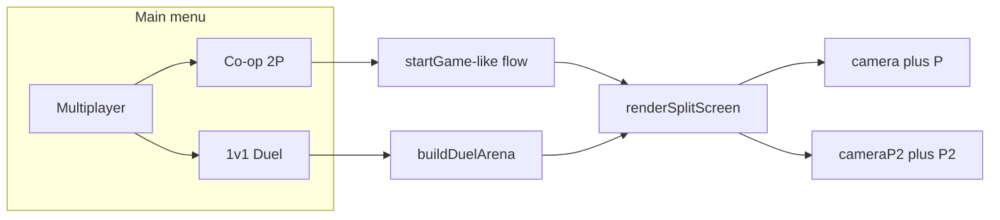

# Local split-screen: Co-op + 1v1

## Current architecture (constraints)

- All gameplay assumes one global player object [`P`](src/main.js) (~line 10759) and one [`camera`](src/main.js). Movement, shooting, AI, [`takeDamage`](src/main.js) (~19979), [`hudUpdate`](src/main.js), and [`PLAYER_PROXY`](src/main.js) (~10800) are wired to that single state.
- Frame render goes through [`_renderFramePost`](src/main.js) → [`createRenderSubsystem`](src/rendering.js) (composer / WebGPU post). There is no split viewport today.
- Alternate modes already exist via flags + custom start paths, e.g. [`startEndlessMode`](src/main.js) (~17429) sets `G.endlessMode`, rebuilds level with [`buildLevel(scene, G.building)`](src/main.js) (~1624), and [`quitToMain`](src/main.js) (~11884) tears down level/enemies but does **not** reset `ENDLESS`; multiplayer modes will need explicit cleanup there too.
- [`tickGamepad`](src/main.js) (~18365) currently maps **one** gamepad into `P` and partially synthesizes `K` keys — split-screen will need **per-player input routing** (no longer writing one pad into `P` globally).

## Assumptions (document in PR / tweak if you disagree)

- **Co-op failure rule**: If either operator reaches `hp <= 0`, treat as mission failure (same defeat flow as solo), unless you later add revive — simplest match to "same as now."
- **Default inputs (includes multi-controller)**:
  - **Two gamepads**: In coop/duel split-screen, **gamepad index 0** drives **player 0** (`P` / left pane) and **gamepad index 1** drives **player 1** (`P2` / right pane). Both sticks aim and both triggers fire for their slot; no shared global `M` state between players.
  - **Mixed**: If only **one** gamepad is connected, keep **WASD + mouse → player 0** and **single pad → player 1** (current couch-PC default). If **zero** pads, player 1 needs either a second pad or split-keyboard (explicitly **out of scope for v1** unless you add it).
  - **Optional later**: Remapping UI (swap which pad is P1/P2), Steam Input–style reordering.
- **Not in v1 unless requested**: Full **dual-keyboard** (separate key maps for two KB players) — extra scope.
- **Post-processing in split view**: First implementation uses **two half-frame renders** via `renderer.setScissorTest(true)`, `setViewport`, `setScissor`, and [`_renderFrameDirect(cam)`](src/main.js) (~9318) **per eye**, with composer **disabled while** `G.splitScreenActive` (or similar) so behavior matches WebGL/WebGPU without rewriting the composer chain. Re-enable fancy PP later if you extend `rendering.js`.

---

## 1) Menu: "Multiplayer" hub

**Files**: [`index.html`](index.html) (overlay `#menu-buttons` ~711–719), [`src/main.js`](src/main.js) (listeners near other menu wiring ~20597+).

- Add a primary **MULTIPLAYER** control that opens a small submenu (new overlay panel or inline hidden `#mp-submenu` with two CTAs: **Co-op (2P split)** and **1v1 Duel**).
- Wire buttons to `startCoopCampaign()` and `startDuelMode()` (new functions), mirroring how [`startGame`](src/main.js) / [`startEndlessMode`](src/main.js) hide `#overlay`, set `G.started`, call `tryLock()`, `musicInit()`, then start the correct level path.

---

## 2) Core mode state

Add to global `G` (or a tiny `MULTIPLAYER` const next to `ENDLESS`):

- `G.playMode`: `'solo' | 'coop' | 'duel'`
- `G.splitScreenActive` (boolean)
- Duel-only: `DUEL.scores`, `DUEL.winTarget` (=10), `DUEL.spawn` positions/rotations, `DUEL.respawnUntil` per player

Ensure [`quitToMain`](src/main.js) resets `playMode`, `splitScreenActive`, duel state, clears second player, restores composer usage, and resets camera aspect to full window.

---

## 3) Second player representation

**Minimal invasive shape** (avoids rewriting thousands of `P.` references in one pass):

- Keep **`P` as player 0** (host) so most systems keep working.
- Introduce **`P2`** as a second object with the **same fields** as `P` where needed: `pos`, `yaw`, `pitch`, `hp`, `dead`, weapon/ammo copies (or shared weapon table with per-player ammo arrays), `maxHp`, etc.
- Add helpers: `localPlayer(n)`, `forEachLocalPlayer(fn)`, `aliveLocalCount()`.

Longer-term refactor to `PLAYERS[]` is possible; not required for v1 if all split-specific code goes through helpers.

---

## 4) Split-screen rendering

**Files**: [`src/main.js`](src/main.js) — central tick where [`_renderFramePost`](src/main.js) is invoked (~21650, ~21859, ~22877).

- Create **`cameraP2`** (`PerspectiveCamera` sharing near/far with main camera).
- On `resize`: when `G.splitScreenActive`, set both cameras' `aspect` to `(innerWidth/2) / innerHeight` (horizontal split) or full width × half height for vertical split; **horizontal** is the usual couch default.
- Replace single `_renderFramePost()` with **`renderSplitScreen()`** when active:
  - `renderer.setScissorTest(true)`
  - Left half: `setViewport` + `setScissor`, update `camera` from `P`, attach **P1 viewmodel** (`gunGrp`) to `camera` if needed, `_renderFrameDirect(camera)` (or composer path if you later add support).
  - Right half: same for `cameraP2` and `P2` + **`gunGrpP2`** (duplicate or cloned viewmodel group).
- **Sky / scene** is shared; only cameras differ.

---

## 5) Per-player input (multi-controller)

**Files**: [`src/main.js`](src/main.js) — [`tickGamepad`](src/main.js), keyboard handlers (~11103+), [`shoot`](src/main.js) / mouse button state object `M`.

- **Enumerate pads**: `navigator.getGamepads()`; collect connected indices (stable mapping: use `gamepad.index` where available).
- **Split-screen coop/duel — two controllers**:
  - **Pad A** (lowest connected index, typically 0) → **player 0** (`P`, `camera`): sticks, triggers, face buttons update only that player's state (`M0` or per-player struct).
  - **Pad B** (next connected index, typically 1) → **player 1** (`P2`, `cameraP2`): same, isolated (`M1`).
  - Do **not** merge both pads into one `P` (today's bug-prone pattern); call `applyGamepadToPlayer(pad, playerSlot)` twice per frame when two pads exist.
- **Mixed mode (one pad)**: Mouse look + LMB/RMB → **player 0** only; the single gamepad → **player 1** only (no stick aim on P1 from that pad to avoid fighting the mouse).
- **Solo / non-split**: Preserve existing behavior (first connected pad can assist or fully drive `P`, per current `tickGamepad` semantics).

Refactor `tickGamepad` into **`applyGamepadToPlayer(pad, slot, playerObj, cam, buttonState)`** so each slot has its own `lmbHeld` / `rmbDown` / weapon cycle, and `shoot()` reads the correct slot for the active camera during each half's simulation tick (or run two weapon ticks if you separate fire logic per player).

**Pointer lock**: Still one pointer; when **two pads** are active, neither player uses mouse for look (both use sticks). When **one pad + KB+M**, mouse affects only P1 as today.

**Implementation note**: `gamepadconnected` toast already exists; consider a second-line hint in split modes: "P1: pad 0 · P2: pad 1" when two pads detected.

---

## 6) Co-op campaign

**Start path**: `startCoopCampaign()` — same flow as [`startGame`](src/main.js) but set `G.playMode='coop'`, `G.splitScreenActive=true`, skip or shorten story if awkward for two (or keep — product choice), then [`startBuilding`](src/main.js) as today.

**World / progression**

- **Spawn**: On [`startBuilding`](src/main.js) after `P.pos.set(...)`, set `P2.pos` to a nearby offset (e.g. +1.2 m on X) with clear [`_snapSpawnOutOfWalls`](src/main.js) if available.
- **Enemy AI targeting**: Anywhere distance/LOS uses `P.pos` toward "the player," change to **nearest of `P.pos` and `P2.pos`** (or both within range — start with **nearest** for performance and clarity). Grep hotspots already found many `P.pos` uses in AI (~10953, ~18483, etc.); coop touches **enemy decision** paths, not every cosmetic `P.pos` reference.
- **Damage to players**: [`takeDamage`](src/main.js) becomes `takeDamageFor(slot, amt)`; keep `takeDamage` as `takeDamageFor(0, amt)` for compatibility. Enemy bullet / melee paths that call `takeDamage(...)` must pass **correct slot** (based on which proxy was hit — see below).
- **Hit proxies**: Extend [`PLAYER_PROXY`](src/main.js) pattern to **`PLAYER_PROXY2`** for P2's world mesh used for **hit detection only** (and optional silhouette). Enemy weapon traces already have patterns hitting the player around ~7135 — branch on which proxy was struck.
- **HUD**: New DOM block **top-left**, stacked: **P1 HP** and **P2 HP** (reuse styling from [`#hp-bar`](index.html) ~34–35). Update in `hudUpdate` or a small `hudUpdateSplit()` when `G.splitScreenActive`. Optionally duplicate minimal per-eye HUD (ammo) later; v1 can show **both health bars globally** (readable) while each half keeps bottom HUD for **local** player only — clearest UX: **each viewport shows only that player's ammo** via CSS clip or duplicate `#bottom` per split pane.

**Death**: If `P2.hp <= 0` or `P.hp <= 0`, run same defeat / [`showDefeatScreen`](src/main.js) path as solo (disable last-stand for P2 or mirror rules consistently).

---

## 7) 1v1 duel mode

**Start path**: `startDuelMode()` — `G.playMode='duel'`, `G.splitScreenActive=true`, **no campaign progression / no meta save** (recommend), clear `G.enemyMgr` or never populate enemies.

**Arena**

- Add **`buildDuelArena(scene)`** (either in [`main.js`](src/main.js) beside `buildLevel` or a small [`src/duelArena.js`](src/duelArena.js) imported once). Goal: **flat floor + many cover blocks** (boxes/crates), **symmetric** spawn points facing inward, bounds to prevent falling off.
- Register walls in the same structure [`buildLevel`](src/main.js) uses (`levelData.walls` or whatever `wallRaycast` expects) so shooting and collision stay consistent — **inspect** `buildLevel` return shape (~1624+) and mirror the minimal fields (`walls`, `cleanup`).

**Rules**

- **Scores** `DUEL.scores[0/1]`, first to **10**.
- On lethal hit on opponent: increment scorer, start **1 s** respawn timer for victim; timer end → teleport victim to their **spawn pose**, full HP, clear `dead`, clear death cam.
- **Disable** solo-only systems for duel: last stand, death-cam delay to defeat screen, enemy director, mission objectives, shop/run save — gated by `G.playMode==='duel'`.

**PvP projectiles**

- In [`tickProjectiles`](src/main.js) / ray segment tests (~12600+), after enemy/wall checks, **ray vs capsule** (or AABB) for **opponent's** `pos` + eye height. Apply damage with friendly-fire rules only in duel (never hit teammate in coop).
- Knives / grenades: either **disabled in duel v1** or same PvP rules with clear radius — recommend **guns only v1** to limit edge cases.

**HUD**: Top-center or top of each pane: `0 — 0` style score; respawn countdown toast optional.

---

## 8) Integration checklist (order of work)

1. Mode flags + `quitToMain` cleanup + menu UI.
2. `P2` object + second camera + split render path (verify in browser with **two colored cubes** at each spawn before full gameplay).
3. Input routing: **two-gamepad** path (pad0→P, pad1→P2) + mixed fallback (mouse→P, single pad→P2).
4. Duel arena + PvP projectile hit + score/respawn loop.
5. Co-op: spawn P2, dual health HUD, enemy target selection, `takeDamageFor` + proxy hits.
6. Polish: pause menu behavior (both frozen), sensitivity, audio listener position (average or follow P1), runtime luma check skipping when split if needed ([`_sampleRuntimeFrame`](src/main.js) ~9327).

---

## Risk / scope notes

- **Size of `main.js`**: expect **large** diffs; keep new duel arena in a separate module to isolate geometry from the 20k-line file where possible.
- **Composer**: disabling PP in split mode is the pragmatic first ship; document as known visual difference.
- **Co-op objectives / doors / setpieces**: many triggers may still be **P1-only** in v1; list follow-ups (exit zone, interactions) if both players must stand on markers.
