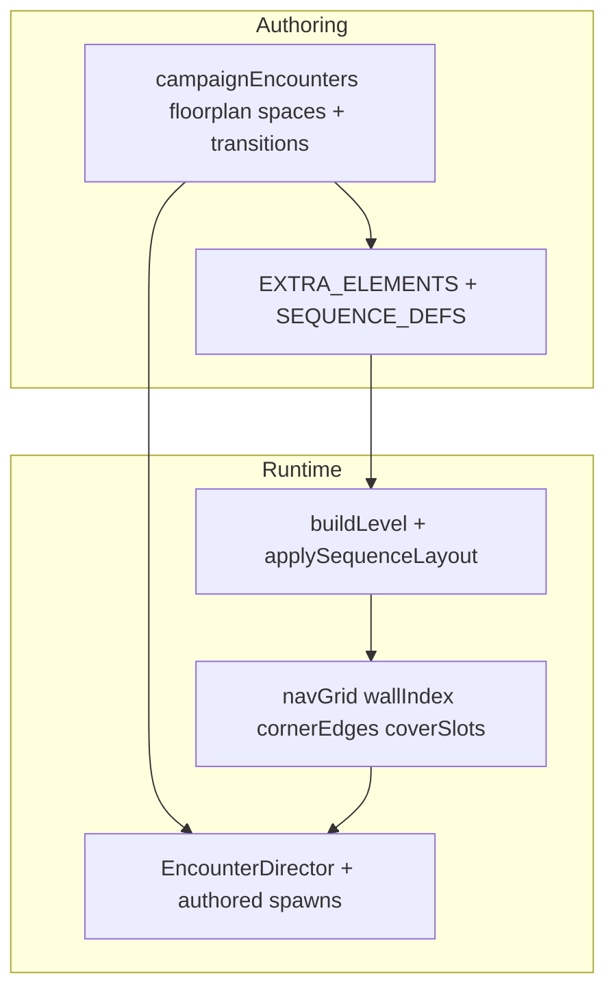

# Tactical sub-rooming and “tunnel” flow — full roadmap

## Where you are today (ground truth)

- **Macro flow**: Three bands (front / mid / back), zone doors, and [`buildLevel`](src/main.js) still define the spine.
- **Meso layout**: [`applySequenceLayout`](src/levelSequences.js) runs a **shared** [`buildCellSkeleton`](src/levelSequences.js) (partition strips + doorway gaps), then per-building [`SEQUENCE_DEFS`](src/levelSequences.js) decoration, then [`EXTRA_ELEMENTS[bn]`](src/levelSequences.js) (`divider` / `window` / props). This is the main lever for sub-rooms today.
- **Authoring intent**: [`CAMPAIGN_LEVELS_REWORK_PLAN.md`](CAMPAIGN_LEVELS_REWORK_PLAN.md) and [`LEVELS_PLAN.md`](LEVELS_PLAN.md) already state the target: rooms with thresholds, hallways, flank loops, and encounters mapped to architecture—not “more props.” Your ask is the **physical buildout + flow** half of that vision, pushed further.

## Design principles (non-negotiables)

1. **Room = boundary + decision**: Every new sub-volume should change *route*, *sightline*, or *commitment* (not only visuals). Align with LEVELS_PLAN “one verb per beat” where each *connector* also has a verb (squeeze, peek, flank, delay).
2. **No dead ends without purpose**: Branching is good; cul-de-sacs only if they hold loot, a read, or a flank return. Prefer **loops** that reconnect to the spine (already described in the campaign rework doc).
3. **Clearance contract**: Any authored corridor must pass **player capsule + AI R** against `wl` (lesson from B01 apron vs [`PR`](src/main.js)); automate checks (extend [`scripts/b01-doorway-screenshot.mjs`](scripts/b01-doorway-screenshot.mjs) pattern).
4. **Zone doors and spawn doors stay sacred**: Geometry that crosses [`ZONE_Z_SPLIT`](src/main.js) / [`alertDoorways`](src/main.js) / spawn-door lanes must be validated—same rule that blocked the apron regression.

## Phase A — Authoring model and validation (foundation)

**Goal**: Treat “sub-room graph” as **first-class data**, not only ad-hoc `divider` rows.

- **A1 — Floorplan graph hardening** (extend [`src/campaignEncounters.js`](src/campaignEncounters.js) per building, starting with B01 template):
  - For each `floorplan.spaces[id]`, require: `bounds`, `exits[]`, optional `primaryRoutes[]` (ordered room ids for the “happy path”), and optional `connectorWidth` hints.
  - Keep `requiredGeometry` / `geometryId` links to [`EXTRA_ELEMENTS`](src/levelSequences.js) meshes (already used in B01) so **narrative intent ↔ built mesh** stays traceable.

- **A2 — Automated checks** (new or extend [`scripts/validate-campaign.mjs`](scripts/validate-campaign.mjs)):
  - **Reachability**: After `buildLevel(bn)` (via headless page + `window.__game.debug.buildLevel` or a future thin export), flood `navGrid` from spawn-ish point to exit-ish point; fail if disconnected components cover mandatory rooms.
  - **Corridor clearance**: Axis-aligned sweep boxes (player `PR`, enemy R) along authored polylines for each `transition` of kind `doorway` / `connector`.
  - **Zone-door column**: Assert no `wl` overlap in a fixed “approach prism” per door (generalize the B01 script).

- **A3 — Debug UX** (extend [`window.__game.debug`](src/main.js)):
  - Overlay: active space id, exit list, next transition, and “blocked edge” if validation fails in dev.

**Exit criteria**: CI or `npm run validate:*` fails if a building’s authored graph is not physically consistent with baked `wl`/`navGrid`.

## Phase B — Geometry vocabulary (make “tunnels” cheap to author)

**Goal**: Fewer one-off dividers; more reusable **connector kits** that read as hallways and vestibules.

- **B1 — New / extended `ELEMENT_BUILDERS`** in [`src/levelSequences.js`](src/levelSequences.js) (names illustrative):
  - `corridor`: two parallel walls + optional ceiling strip; params: length, width (e.g. 1.1–1.5m), `rotY`, doorway gaps.
  - `vestibule`: short dog-leg or offset door (two `divider`s today; one builder reduces mismatch bugs).
  - `dogleg` / `offsetThreshold`: two short segments with guaranteed gap alignment (fixes “gap math drift” across buildings).

- **B2 — Building-specific skeleton overrides** (optional second path in `applySequenceLayout` *before* or *instead of* parts of `buildCellSkeleton` for selected `bn`):
  - Today the **same** partition skeleton applies to all buildings ([`buildCellSkeleton`](src/levelSequences.js)); for “maze without maze,” **per-building bone variants** (narrower ME/MW choke, angled stub into BC, etc.) matter more than infinite `EXTRA_ELEMENTS` patches.

- **B3 — Vertical connectors where LEVELS_PLAN already points** ([`LEVELS_PLAN.md`](LEVELS_PLAN.md) §2.2): reuse `floorRegion`, `vl`, stairs patterns from B02/B03-style blocks in [`src/main.js`](src/main.js) to make sub-rooms **stacked** as well as lateral—adds “bigger feel” without widening `RW/RD`.

**Exit criteria**: At least 3 new builder types used in **two** buildings each, with no new `PointLight` budget violations (per campaign plan non-goals).

## Phase C — Per-building content waves (the “fully” part)

**Goal**: Each of the 12 buildings gets a **distinct route sheet**: entry → 1–2 compressions → side pocket(s) → threshold → signature → exit—**variation by identity**, not copy-paste.

Suggested order (risk / payoff):

| Wave | Buildings | Intent |
|------|------------|--------|
| C1 | B01, B06, B11 | Already “industrial / linear / narrow” fantasies—prove corridor kit + validation |
| C2 | B05, B08 | Grid / ward reads—**lateral** sub-rooms and glass lanes |
| C3 | B02, B04, B10 | Formal / vertical prestige—mezzanine + choke entry |
| C4 | B03, B07, B09, B12 | Asymmetric pits, deck lines, desert reads—**diagonal** or staged connectors (per LEVELS_PLAN §2.3, still AABB-friendly) |

For each building deliverable:

- Updated [`EXTRA_ELEMENTS[bn]`](src/levelSequences.js) **and/or** skeleton override.
- Updated [`floorplan.spaces` / `transitions`](src/campaignEncounters.js) to match new doors.
- **Encounter pass**: [`authoredSpawns`](src/campaignEncounters.js) + patrol tags so enemies **hold** or **peek** corridors (not open-field circles)—[`src/encounterBehavior.js`](src/encounterBehavior.js) / [`ENCOUNTER_PATROL_ROUTES`](src/main.js) already exist.

**Exit criteria**: Playtest script or checklist per building: “≥ N distinct choke reads,” “≥ 1 optional side loop,” “signature room still readable.”

## Phase D — AI and pacing tied to architecture

**Goal**: Sub-rooms change **behavior**, not only path length.

- **D1 — Room-aware hooks**: Use `enemy.roomId` + [`pickFloorplanSpaceId`](src/encounterDirector.js) / [`pickSequenceCellId`](src/levelSequences.js) to bias states (e.g. higher `holdRiskCap` in narrow connectors, different peek offsets near `isWindow`).
- **D2 — Reinforcement / alarm ingress**: Spawn doors and alarm pairs must respect **new** choke geometry ([`_spawnB01AlarmReinforcements`](src/main.js) pattern; generalize for other buildings).
- **D3 — Director objectives**: Optional `opensOn` / partition soft-lock already sketched in campaign JSON—wire more objectives to **traverse** subrooms, not only kill clears.

**Exit criteria**: Measurable difference in average engagement distance per building (telemetry optional); no softlocks in `checkZoneClears` / zone population edge cases.

## Phase E — “Bigger feel” polish (non-size tricks)

- **Audio / lighting**: Short tunnels get different reverb profile or fog slice (reuse existing lighting controller hooks in [`buildLevel`](src/main.js)).
- **Signage / identity**: [`addSequencePlacard`](src/levelSequences.js) and landmark meshes at **decision nodes** (T-junctions), not random props.
- **Minimap / pause map**: If [`_drawBuildingMap`](src/main.js) exists, add optional overlay of **floorplan space** labels in dev builds for navigation QA.

## Risks and mitigations

| Risk | Mitigation |
|------|------------|
| Nav / cover bake cost spikes | Incremental rebake only on breakable changes (already partially done for doors); keep `wallIndex` cell size tuned |
| AI stuck in new chokes | Reachability + `navSnapOpen` paths; widen minimum connector after playtest |
| Authoring drift (JSON vs mesh) | `requiredGeometry` audit + validate script |
| Scope creep | Lock **Wave C** per milestone; ship skeleton variants for 3 buildings before all 12 |

## Documentation deliverable

- Add **`SUBROOM_FLOW_PLAN.md`** (short) linking this roadmap to [`CAMPAIGN_LEVELS_REWORK_PLAN.md`](CAMPAIGN_LEVELS_REWORK_PLAN.md) Phase “physical buildout” so future agents do not duplicate strategy.

---

**Summary**: “Fully” means **(1)** data + validation for a real room graph, **(2)** geometry kits + per-building skeleton variation, **(3)** twelve authored route sheets with encounter alignment, **(4)** AI/pacing that reads the new architecture, **(5)** polish that sells scale without inflating `RW/RD` blindly. Existing docs already justify the direction; execution is phased content + tooling on top of [`levelSequences.js`](src/levelSequences.js) and [`campaignEncounters.js`](src/campaignEncounters.js).
