# CLEARANCE — Levels + Tactical AI + Leaning Upgrade Plan

> **Working dir:** `/Users/tobiasmastek/Desktop/firstpgame`
> **Surfaces:** `src/main.js` (single 16k-line file), `src/levelSequences.js`, `index.html`, `scripts/*.mjs`
> **Constraints:** Vite + three@0.170 only. Preserve `clearance_progress` / `clearance_settings`. Don't
> revive disabled GLB soldier/deagle paths. Keep the game runnable after every phase.
> **Reference:** `LEVELS_PLAN.md` (design intent), `GAME_COMPLETION_MASTER_PLAN.md` (campaign rules),
> `README.md` §"When the rig misbehaves" (Meshy soldier scale gotcha).

---

## 0. Why this plan exists

Three things hold the campaign back from feeling like a real tactical shooter:

1. **Buildings still read as flat rectangles.** `buildLevel()` (`src/main.js:1015`) uses one `RW`/`RD`
   per building (`BUILDING_DIMS` `src/main.js:90-91`), a flat floor, and axis-aligned walls. The
   3×3 cell skeleton works but every building is a slightly redecorated box. `LEVELS_PLAN.md`
   already calls this out — this plan executes on it.
2. **Enemies don't use cover the way humans do.** The state machine
   (`PATROL/ALERT/CHASE/ATTACK/SEARCH/FLANK` `src/main.js:3314, 4778-4870`) plus the sine-wave
   "peek" at `src/main.js:4872-4878` is a sidestep wiggle, not a corner peek. Enemies stand in the
   open, expose their full silhouette while shooting, and never slice corners.
3. **Lean is one frame deep.** `P.lean` (`src/main.js:16416-16417`) is Q/E → camera-x offset +
   `rotation.z` roll (`src/main.js:16578, 16631`). No anti-clip raycast, no body lean, no enemies.

This plan fixes all three together because they share infrastructure: the **cover/corner graph**
baked at level load is consumed by AI peek logic, by enemy lean anims, and by the player's
lean-aware sightline check.

---

## 1. North stars (don't violate these)

1. **Save compatibility.** `clearance_progress` (`src/main.js:14460-14472`) and
   `clearance_settings` (`src/main.js:7850-7852`) keep loading. Add fields with safe defaults; never
   rename or drop existing keys.
2. **One ambitious branch, no parallel ones.** Everything goes on a single working branch and ships
   as one PR (combined). Mid-phase commits are encouraged; parallel streams are not.
3. **Runnable after every phase.** `npm run build` and `node scripts/smoke-test.mjs` must stay
   green. Stage new behavior behind `SETTINGS` flags when in doubt — flip them on at the end of each
   phase, not mid-phase.
4. **Procedural before authored.** Bake corner edges and cover slots from existing wall AABBs first
   (Phase 2). Hand-authoring per-building peek points is an opt-in override, not a requirement.
5. **No new runtime libraries.** No A* lib, no behavior-tree lib, no IK lib. Hand-roll on the
   existing `_navAStar` / mixer / bone-tween infrastructure.
6. **Don't pass `precise=true` to `setFromObject` on the Meshy rig.** Mentioned only because Phase 4
   touches torso bones — see `README.md` §"When the rig misbehaves".

---

## 2. The whole-plan picture

```mermaid
flowchart LR
  subgraph P1[Phase 1 — Maps]
    DIMS[per-bldg dims arrays]
    VERT[verticality: pit/mezz/catwalk]
    DIAG[diagonal/curved walls]
    COVERGR[cover grammar: knee/chest/full]
  end
  subgraph P2[Phase 2 — Cover graph]
    CE[cornerEdges from walls]
    CS[coverSlots: peekL/peekR/full]
    NAVH[navGrid height layers]
  end
  subgraph P3[Phase 3 — Tactical AI]
    BT[behavior tree per archetype]
    HC[HOLD_CORNER state]
    PEEK[PEEK_FIRE state]
    SUP[SUPPRESS+FLANK pair logic]
  end
  subgraph P4[Phase 4 — Enemy lean anim]
    SPINE[spine bone tween]
    HEAD[head poke perpendicular to edge]
    WPN[weapon group lean offset]
  end
  subgraph P5[Phase 5 — Player lean upgrade]
    AC[anti-clip raycast]
    BODY[body+arms lean rig]
    LOS[lean-aware LOS for shoot/AI]
  end
  subgraph P6[Phase 6 — Tuning + UX]
    TELE[__game.debug.aiPeekStats]
    DIFF[difficulty-scaled peek timing]
    PERF[perfHud counters]
  end
  subgraph P7[Phase 7 — Tests + polish]
    SMOKE[smoke-test additions]
    REG[campaign-regression beat asserts]
    SNAP[debug snapshot fields]
  end
  P1 --> P2
  P2 --> P3
  P2 --> P4
  P2 --> P5
  P3 --> P6
  P4 --> P6
  P5 --> P6
  P6 --> P7
```



A run of this plan is roughly: **Phase 1 ≈ 25 min, Phase 2 ≈ 15 min, Phase 3 ≈ 25 min,
Phase 4 ≈ 15 min, Phase 5 ≈ 15 min, Phase 6 ≈ 10 min, Phase 7 ≈ 15 min.** Aim for ~120 min total
agentic time; hard floor is 60 min. Cut Phase 1 verticality to two buildings if behind.

---

## 3. Code anchors (verified during exploration)

Anything below this section line that names a function or a line range refers back to this table.
Update the table if line numbers drift during the work.

### 3.1 Levels / maps

| Concern | Location | Notes |
|---|---|---|
| Top-level level builder | `src/main.js:1015-3310` `buildLevel(bn)` | Returns `{walls, vaultables, zoneBounds, spawns, zoneDoors, spawnDoors, navGrid}` (`:3311`) |
| Per-building dims | `src/main.js:90-91` `BUILDING_DIMS` | Per-bn RW/RD; currently one constant set, must become per-bn for §4.1 |
| Zone Z split | `src/main.js:1086` `ZONE_Z_SPLIT` | Front/middle/back partition |
| Walls AABB list | `src/main.js:1018, 1092-1107` `wl` (`walls`) | `{x0,x1,z0,z1}` boxes; consumed by AI LOS + nav |
| Vault props | `src/main.js:1018, 5324` `vl` | Cover anchors; enemies bind perpendicular here |
| Spawn doors | `src/main.js:3219-3236` `spawnDoors`, `tickSpawnDoors` | Animated wave gates |
| Zone doors | `src/main.js:1164-1192` `zoneDoors`, `openZoneDoor` | Hard-commit gates |
| Building meta | `src/main.js:15488-15497` `BUILDING_INFO` | Names, threat, target |
| Campaign data | `src/main.js:15506-15514` `CAMPAIGN_LEVELS` | Beats, enemy bias, mastery |
| Sequence layout | `src/levelSequences.js:22-59` `applySequenceLayout` | Calls `buildCellSkeleton` + decorate |
| Cell defs | `src/levelSequences.js:1258-1887` `SEQUENCE_DEFS` | 8 buildings × 8 cells × elements |
| Cell regions | `src/levelSequences.js:64-73` `CELL_REGIONS` | x0/x1/z0/z1/midX/midZ for placement |
| Encounter tags | `src/levelSequences.js:1831-1838` `ENCOUNTER_BEATS` | read/brawl/hold/snipe/stealth/boss |
| Zone roles | `src/levelSequences.js:1846-1887` `BUILDING_ZONE_ROLES` | Per-bn front/mid/back roles |
| Gameplay profile | `src/levelSequences.js:1889-1896` `getSequenceGameplayProfile` | Read by AI difficulty + spawner |

### 3.2 Enemy AI

| Concern | Location | Notes |
|---|---|---|
| State constants | `src/main.js:3314` `PATROL/ALERT/CHASE/ATTACK/SEARCH/FLANK` | Add new states here |
| Enemy class | `src/main.js:3315-4972` `class Enemy` | Constructor at `:3316` |
| Type stats table | `src/main.js:3319-3331` `TS` | 12 types; add `peekRate`, `peekHoldMs` here |
| State machine update | `src/main.js:4778-4870` | Where new tactical states integrate |
| Cover anchor pick | `src/main.js:5292-5325` `coverPoint` assignment | Replace with corner-aware slot pick (Phase 3) |
| Sine-wave fake peek | `src/main.js:4872-4878` | DELETE; replace with `peekState` driven offset |
| Head/torso bone tween | `src/main.js:4342-4495` (`bodyRX/RY/RZ`, `lARX`/`rARX`) | Where Phase 4 lean anim hooks in |
| `canSee` LOS | `src/main.js:4621-4660` | Add lean offset arg in Phase 5 |
| NavGrid build | `src/main.js:5025-5036` `_buildNavGrid` | Layer for "above mezz" in Phase 1 verticality |
| A* | `src/main.js:5057-5115` `_navAStar` | Reused as-is |
| Aim pitch / shoot | `src/main.js:3360, 4448, 4763-4767, 4911-4969` | Burst gates; gate on `peekState==FIRE` |
| EnemyManager | `src/main.js:5191-5395` `class EnemyManager` | Spawner; assigns roles per zone |
| Alertness tick | `src/main.js:13743, 16333` `tickEnemyAlertness` | Every-4-frame proximity sweep |

### 3.3 Player + animations + persistence

| Concern | Location | Notes |
|---|---|---|
| Player lean input | `src/main.js:16416-16422` Q/E + vignette | Smoothed `P.lean ∈ [-1,1]` |
| Lean camera offset | `src/main.js:16578, 16589-16591` | Camera x/z offset along right vector |
| Lean roll | `src/main.js:16631` `camera.rotation.z = P.lean*-0.12` | Cosmetic roll |
| Procedural anim params | `src/main.js:4348-4355` per-type `gait` | `spd, armAmt, legAmt, bob, leanRun` |
| AnimationMixer (disabled) | `src/main.js:4161-4169, 4714` | Don't revive without GLB fix |
| Debug snapshot | `src/main.js:17195-17224` `window.__game.debug` | Extend with peek/lean fields |
| Persistence keys | `src/main.js:7850-7852` `clearance_settings`, `:14460-14472` `clearance_progress` | Add fields with defaults |
| Test scripts | `scripts/smoke-test.mjs`, `scripts/campaign-regression.mjs` | Extended in Phase 7 |

If a line number is off by a few when you arrive (`main.js` is a moving target), grep first; don't
trust the number blindly.

---

## 4. Phase 1 — Maps: per-building shape, not just per-building paint

### 4.1 Promote `BUILDING_DIMS` to per-bn arrays

Today `RW`, `RD`, `RH` are scalars selected by `bn` inside `buildLevel`. Replace with a single
**`BUILDING_DIMS[bn]`** dict at `src/main.js:90-91`:

```js
const BUILDING_DIMS = {
  1: { RW: 44, RD: 64, RH: 4.25, layers: ['floor', 'catwalk'] },         // Loading Dock
  2: { RW: 38, RD: 56, RH: 4.5,  layers: ['floor', 'mezzanine'] },        // Continental Lobby
  3: { RW: 36, RD: 52, RH: 4.25, layers: ['pit', 'floor', 'vipDeck'] },   // Nightclub
  4: { RW: 32, RD: 60, RH: 4.5,  layers: ['floor'] },                     // Penthouse (sunken pit inside)
  5: { RW: 40, RD: 60, RH: 4.25, layers: ['floor', 'roofBridge'] },       // Sterling Medical
  6: { RW: 36, RD: 70, RH: 4.5,  layers: ['trackPit', 'platform'] },      // Subway Line 7
  7: { RW: 28, RD: 64, RH: 4.0,  layers: ['lower', 'deck'] },             // Azure Yacht
  8: { RW: 44, RD: 56, RH: 4.5,  layers: ['raisedFloor', 'floor'] },      // Server Farm Δ
};
```

Audit every site that reads `RW`/`RD`/`RH` inside `buildLevel` (and `applySequenceLayout`) and pull
from this dict. `ZONE_Z_SPLIT` (`:1086`) becomes proportional to `BUILDING_DIMS[bn].RD`. Spawn-door
offsets and zone bounds scale automatically once the constants do.

**Acceptance:** Each building's silhouette in playtest reads visibly distinct (yacht is *narrow and
long*, server farm is *wide-ish and grid-feeling*). `node scripts/campaign-regression.mjs` still
loads B01.

### 4.2 Verticality per building (highest leverage from `LEVELS_PLAN.md` §2.2)

Implement at minimum **3 of 4** of these. Pick the buildings that match `BUILDING_DIMS.layers`:

- **B3 Nightclub pit:** lower a 6×6m region by 0.9m at FC. Add 3-step deck at the rim (`plat`
  elements already exist in `SEQUENCE_DEFS`). Player capsule already steps; add walls along the rim
  for chest cover at the upper level.
- **B2 Continental mezzanine:** half-floor at y=2.4m above FW–FE arc. Stair from BE goes up. Two
  shooting lanes down through railings (railings = thin walls, AI must pathfind around the stair).
- **B1 Loading Dock catwalk:** walkable from FE to BE at y=2.5m. One drop-down between FE and the
  containers. NavGrid layered (see §4.4).
- **B6 Subway track pit:** lower a 3m-wide track region by 1.2m running the building's length.
  Live-rail hazard tile already exists in middle zone (`SEQUENCE_DEFS` calls it out as a hazard).

NavGrid (`_buildNavGrid` `:5025-5036`) becomes **layered**: `blocked[]` becomes
`blocked[layerIdx][cellIdx]`. AI agents store `this.navLayer` and switch when they cross a stair or
drop edge. Drop edges are tagged by a new `dropEdges[]` returned from `buildLevel`.

**Don't** try to do all 8. Three buildings with real verticality teach the engine; the others can
follow in a subsequent pass.

### 4.3 Diagonal and curved hero walls

Per `LEVELS_PLAN.md` §2.3, every wall is axis-aligned today. Add support for **rotated wall
segments** in the `wl` array: store as `{x0,z0,x1,z1, ax, az, w}` (line segment + thickness)
instead of (or alongside) AABB. Update `canSee` (`:4621-4660`) to handle line-segment intersection
when `w` is present. Add **one diagonal hero wall per building**:

- B1: angled container row (45°) cutting BW into an L-corridor.
- B2: apse curve behind the concierge (8 segments at 22.5°).
- B3: the DJ booth front face is angled.
- B4: floor-to-ceiling penthouse curve (already conceptually in plan).
- B5: roof-bridge curve over the courtyard.
- B6: the platform end-cap fans toward the tunnel mouth.
- B7: the yacht hull (segment of a circle 6–8 panels).
- B8: hot/cold aisle separator runs at 30° to the long axis.

Keep the count minimal — *one* per building, not three. AI nav grid quantizes the diagonal walls
into the grid via cell rasterization (just sample N points along each segment and mark blocked
cells). This is a one-screen helper; no new pathfinding work.

### 4.4 Cover grammar — three heights, deliberate

Today decorate elements (`SEQUENCE_DEFS` cells) lean uniform. Per `LEVELS_PLAN.md` §3.4, force
**at least one of each height per cell**: knee (0.55m), chest (0.85–0.95m), full (≥1.6m). Add a
`cover` field to element entries in `SEQUENCE_DEFS`:

```js
{ kind: 'desk', cover: 'chest' }
{ kind: 'rail', cover: 'knee' }
{ kind: 'pillar', cover: 'full' }
```

Default by `kind` if the field is missing — backwards-compatible. Cells missing a full-height
cover get one auto-injected (`pillar`/`locker`) at a procedurally-chosen wall midpoint. **This is
the prerequisite for §4.5 corner edges and §6 enemy peeks** — full-height cover is what gets
peeked.

### 4.5 Corner-edge metadata at the wall level (groundwork for Phase 2)

For every wall AABB and segment, derive its 4 corners on level build. Tag each corner as **outside
corner** (convex from player walking space) vs **inside corner** (concave). Outside corners are
the peek points that drive both AI peeking (Phase 3) and player lean-aware sightlines (Phase 5).

A corner is "outside" if the cell adjacent on the corner's diagonal is walkable (use the navGrid
just built). Store corners on `levelData.cornerEdges[]` from `buildLevel`:

```js
levelData.cornerEdges = [
  { x: 12.4, z: -3.1, nx: 1, nz: 0, // wall normal pointing into open space
    sideDir: 'left' /* relative to nx,nz */, height: 1.6, ownerWallIdx: 17 },
  ...
];
```

A "corner edge" pairs an outside corner with the adjacent open direction along the wall. Each
peekable corner has **two** corner edges (one each side). This is the data Phase 2 turns into
cover slots.

**Acceptance:** `window.__game.debug.cornerEdges()` returns a non-empty array. In dev only, render
small green dots at each `cornerEdges[i].(x,z)` (toggle via `?cornerHud=1`). Spot-check on B1 — at
least 24 corners should be tagged.

### 4.6 Per-building hero set-pieces (creative pass)

`LEVELS_PLAN.md` §5 calls out one hero set-piece per building. Implement **two** in this pass and
leave clear hooks for the rest:

- **B3 Nightclub strobe alarm:** when alarm trips, strobes desync from music — tie to existing
  `alarmTimer`. Reuse pulse renderer; no new shaders.
- **B5 MRI charge-up:** an interactable in BW that, when used, kills enemies inside a 4m radius.
  One-shot; consumes the charge.

Don't overscope creative — Phase 1 is mostly structural. Two set-pieces is enough to prove the
shape works.

---

## 5. Phase 2 — The cover/corner graph

This is the spine that connects maps to AI to lean. Bake once at level load, consume from
multiple systems.

### 5.1 `coverSlots[]` derived from `cornerEdges[]` and `vaultables[]`

For each `cornerEdge` and each full-height vault prop, emit one or more **cover slots**:

```js
{
  x, z,                  // standing position
  faceDir: {x, z},       // direction the slot faces (towards open / threat)
  edgeDir: {x, z},       // direction along the edge — perpendicular to faceDir
  side: -1 | +1,         // which side of the corner; left/right peek
  height: 'chest'|'full',// from §4.4
  owner: { type: 'wall'|'prop', idx },
  riskScore: 0..1,       // computed: how exposed is the slot to current player?
}
```

`coverSlots` is a flat array. Build at the bottom of `buildLevel` after `cornerEdges` and walls
are finalized. Estimated 50–120 slots per building.

### 5.2 Slot-to-player risk scoring

A function `coverSlotRisk(slot, playerPos)` computes a 0–1 score where lower is safer. Cheap:
ray from `playerPos` to `slot.(x,z)` — 0.0 if blocked by any wall, 1.0 if clear. Add a small
penalty proportional to angular alignment between `(slot - player)` and `slot.faceDir` (slots
that face into the threat are best for peeking *out*, not for hiding).

Cache results: only recompute when `playerPos` has moved >0.4m or the player has fired (sound
cue). Reuse the existing every-4-frame `tickEnemyAlertness` cadence.

### 5.3 `getBestPeekSlot(enemy, playerPos)` API

Returns the slot from which the enemy can:
1. See the player from the **peek pose** (slot.x + edgeDir*0.35, slot.z + edgeDir*0.35).
2. **Not** see the player from the **safe pose** (slot.x, slot.z).
3. Reach via `_navAStar` in <2 path segments from current position.

This three-condition filter is what makes AI use corners like soldiers — they need a position
where stepping out *reveals* the target and stepping back *conceals* them. Implement as a single
function in `Enemy` so it's debuggable per-agent.

### 5.4 Acceptance

- `window.__game.debug.coverSlots()` returns the array.
- A new dev visualizer (`?coverHud=1`) renders red dots for high-risk slots from current player
  pos and green for safe ones. Eyeball it: when you stand in front of an open doorway, the slots
  along the perpendicular walls should be green; the slots behind you should be red.
- `getBestPeekSlot` for a fresh enemy at spawn returns a non-null slot in B1, B2, B3.

---

## 6. Phase 3 — Tactical AI: corners, peeks, and pairs

### 6.1 New states (extend `src/main.js:3314`)

```js
const PATROL=0, ALERT=1, CHASE=2, ATTACK=3, SEARCH=4, FLANK=5,
      HOLD_CORNER=6, PEEK_FIRE=7, REPOSITION=8, SUPPRESS=9;
```

Behavior contracts:

- **HOLD_CORNER:** at chosen `coverSlot.safePose`, weapon raised, scanning. Will transition to
  `PEEK_FIRE` on its peek timer or when a teammate is in `SUPPRESS` (see §6.3).
- **PEEK_FIRE:** torso/head shifted to `coverSlot.peekPose`, at most one short burst, then back
  to `HOLD_CORNER`. Hard cap on peek duration scales with archetype + difficulty (§7.2).
- **REPOSITION:** picks a new slot and pathfinds to it. Triggered when current slot has been
  shot at or its risk score crossed a threshold.
- **SUPPRESS:** stand at slot, fire bursts at last-known-player-position regardless of LOS.
  Trades accuracy for tempo so a paired teammate can flank.

### 6.2 Per-archetype profiles

Add to `TS` at `src/main.js:3319-3331`:

```js
soldier:    { ..., peekRate:1.0, peekHoldMs:550, holdRiskCap:0.55, useSuppress:true  },
heavy:      { ..., peekRate:0.4, peekHoldMs:1100, holdRiskCap:0.75, useSuppress:false },
sniper:     { ..., peekRate:0.6, peekHoldMs:300, holdRiskCap:0.30, useSuppress:false },
scout:      { ..., peekRate:1.6, peekHoldMs:300, holdRiskCap:0.45, useSuppress:false },
shielded:   { ..., peekRate:0.0, peekHoldMs:0,    holdRiskCap:0.95, useSuppress:false },
pistolero:  { ..., peekRate:1.4, peekHoldMs:400, holdRiskCap:0.50, useSuppress:false },
riot:       { ..., peekRate:0.0, peekHoldMs:0,    holdRiskCap:0.90, useSuppress:false },
demolitions:{ ..., peekRate:0.5, peekHoldMs:600, holdRiskCap:0.55, useSuppress:true  },
drone:      { ..., peekRate:0.0, peekHoldMs:0,    holdRiskCap:0.0,  useSuppress:false }, // flies
marksman:   { ..., peekRate:0.7, peekHoldMs:350, holdRiskCap:0.30, useSuppress:false },
boss:       { ..., peekRate:0.6, peekHoldMs:700, holdRiskCap:0.65, useSuppress:true  },
lieutenant: { ..., peekRate:0.9, peekHoldMs:550, holdRiskCap:0.55, useSuppress:true  },
```

`peekRate` is peeks/second target when in `HOLD_CORNER` and player is alive + LOS-blocked.
`peekHoldMs` is how long the peek pose holds before retracting. `holdRiskCap` is the slot risk
above which the agent rejects the slot and goes `REPOSITION`. `useSuppress` gates the pair
behavior in §6.3.

### 6.3 Pair coordination — suppress + flank

Once per `EnemyManager` zone tick, scan the active enemies and pair them when:

- Two enemies are within 8m of each other.
- Both have current LOS or recent LOS to player.
- One of them is `useSuppress:true`.

The suppress-capable one enters `SUPPRESS`. Its partner enters `FLANK` (existing state) with the
target slot biased to the *opposite side* of the player from the suppressor. While the
suppressor's burst is firing, the flanker has a movement bonus (1.25× speed). When the suppressor
runs dry (one full burst), pair dissolves.

Cap concurrent pairs per zone at 1 to avoid full mob-scripted feel. This single rule turns
"two enemies stand and shoot" into "two enemies actually trying to win." Hugely worth it.

### 6.4 Search and corner-clearing

`SEARCH` state already exists (`:4828`). Upgrade it: when entering a zone with no current LOS,
pick the corner edge nearest the last-known-player-pos and slice it (`PEEK_FIRE` from the safe
pose). If still no LOS, repeat for the next corner. Soldiers slice corners on entry; that's the
single biggest readable AI behavior.

### 6.5 Replace the sine-wave fake peek

Delete `src/main.js:4872-4878`. The sine-wave wiggle is what made the "peek" feel like a head-bob
glitch. The new `PEEK_FIRE` state owns the offset — driven by the slot's `peekPose` minus
`safePose`, lerped over 200ms in, hold for `peekHoldMs - 400ms`, lerped 200ms out.

### 6.6 Acceptance

- Spawn a single soldier behind a wall corner in a debug room (extend `window.__game.debug` with a
  `spawnAt(type, x, z)` helper). Stand on the other side. Soldier should slide to the corner,
  poke head out, fire one short burst, retract. Repeat.
- In a normal B1 wave, eyeball test: enemies should not be standing in the open in chest-cover
  cells. They should be hugging full-height cover. At least 60% of shots fired should originate
  from a `PEEK_FIRE` pose (see §8.1 telemetry).
- Heavy and shielded enemies should still march into the open — their `peekRate` is 0/0.

---

## 7. Phase 4 — Enemy lean / peek animations

The cover-poke offset from §6.5 is camera-grade information; without animation it looks like
sliding statues. Use the existing procedural spine system at `src/main.js:4342-4495`.

### 7.1 Spine + head + weapon coordinated lean

When `enemy.peekState === PEEKING`, drive three additive offsets from the slot:

```js
const peekT = clamp((now - peekStart) / peekHoldMs, 0, 1);
const eased = peekT < 0.2 ? peekT/0.2 : peekT > 0.8 ? (1 - peekT)/0.2 : 1;
const sideSign = slot.side; // -1 / +1
this.bodyRZ_target = -0.18 * sideSign * eased;     // torso roll along edge
this.bodyRY_target =  0.10 * sideSign * eased;     // small twist toward target
this.headRX_target = -0.05 * eased;                // chin down (aiming over weapon)
this.weaponLatX   =  0.18 * sideSign * eased;       // weapon group x offset
```

`bodyRZ`, `bodyRY` already exist (`:4342-4495`); the others are new. Lerp toward `_target` at
~12/s. Apply `weaponLatX` to the weapon group object3D before the existing `aimPitch` rotation.

### 7.2 Head-out / shoulder-out perpendicular to the corner edge

The lean direction is **`slot.edgeDir × slot.side`**, not the enemy's local right vector. This
matters because enemies don't always face the edge head-on (e.g., when they're flanking). Recompute
the body-frame offset by projecting the world-space lean onto the agent's right vector each frame.

### 7.3 Don't break the Meshy rig

Per `README.md` §"When the rig misbehaves": the procedural bone tweens are operating in bind-pose
space. **Don't** add `Box3.setFromObject(rig, true)`. **Don't** add new `mesh.skeleton.update()`
calls. Just lerp the existing local rotations.

### 7.4 Visual fallback when the rig is the simple cube enemy

The disabled GLB path is a known hazard. The procedural bone names (e.g., `lARX/rARX`) only
populate when the soldier rig loaded. For the geometry-only enemies, apply the lean as a body
group rotation and a head mesh x-offset; visually less rich but never crashes.

### 7.5 Acceptance

- In `?coverHud=1` mode, when an enemy enters `PEEK_FIRE`, the visible model leans toward the
  edge and you see one shoulder + the muzzle clear the corner before any shots register.
- Walk past a known peek slot — rig does not snap-pop; lean fades over ~200ms in/out.

---

## 8. Phase 5 — Player lean upgrade

The existing camera-X offset (`src/main.js:16578-16591`) is fine but feels weightless. Three
upgrades:

### 8.1 Anti-clip raycast

Before applying the smoothed `P.lean`, sweep a horizontal ray from the player center along the
right vector to `P.lean * 0.4` (the existing offset magnitude). If it hits a wall AABB or wall
segment, scale `P.lean` down so the camera stops at `hit - 0.08m`. Result: player can't shove
their head through a doorframe.

### 8.2 Body + arms + weapon lean rig

Today only the camera tilts. Add a parented "body group" under camera that holds the weapon
viewmodel; rotate that group on `z` by `P.lean * -0.18` (slightly more than the camera roll).
Effectively the weapon group leans with the body, not just the head. Reuse the existing weapon
view group; don't re-parent — just animate its `rotation.z` and `position.x` (in addition to
camera-only roll).

The arms-down case (when no weapon) — shift body group only. Subtle but huge for first-person
embodiment.

### 8.3 Lean-aware LOS for AI and shooting

`canSee` (`src/main.js:4621-4660`) currently treats the player as a single point. Extend its
signature to optionally take a lean offset:

```js
canSee(targetPos, walls, leanOffset = null)
```

Pass `P.eyePos + rightVec * P.lean * 0.4` when checking AI vision against the player, and pass
the same offset when the player fires a shot raycast (origin shifts with lean). Two small effects:
- Enemies no longer "see through walls" when the player has leaned out then leaned back.
- The player's bullets actually originate from the leaned head pose — peek shots clear corners
  the player thought they were clearing.

### 8.4 Lean reduces ADS sway, increases scope wobble

Tiny detail with big feel impact. Add to the ADS animation tick (`src/main.js:16207-16217` per
exploration map):

- While `|P.lean| > 0.4` and `P.ads > 0.6`: multiply sway by 0.6 (you're braced).
- While `|P.lean| > 0.7`: increase scope wobble amplitude by 1.2×.

Net: a fully-committed peek with ADS feels rewarded but slightly less stable than a non-lean ADS.

### 8.5 Lean cancels on sprint, slide, slide-cancel

Sprint/slide states should pull `P.lean` to 0 with the existing lerp rate. This is one branch in
the existing input handler.

### 8.6 Acceptance

- Stand inside a doorframe; press Q. Camera doesn't clip through the wall. (anti-clip)
- Fire a shot while leaning hard right around a corner. Bullet origin is at the leaned camera pos
  — visible by the muzzle flash being on the right side of the cover.
- An enemy with line of sight to the leaned-out head pose registers it (alertness goes up). Lean
  back: enemy returns to SEARCH, doesn't keep shooting through wall.

---

## 9. Phase 6 — Tuning, telemetry, settings

### 9.1 Difficulty-scaled peek timing

Hook into the existing difficulty system. Multiply `TS[type].peekHoldMs` and divide `peekRate`
by a difficulty factor:

| Diff | peekHoldMs × | peekRate × | Notes |
|---|---|---|---|
| Easy | 1.4 | 0.7 | Enemies expose longer, peek less often |
| Normal | 1.0 | 1.0 | Baseline |
| Hard | 0.7 | 1.3 | Snappier peeks |
| Brutal | 0.55 | 1.5 | Pre-aimed quick-peeks |

### 9.2 `__game.debug` extensions

Add to the snapshot at `src/main.js:17195-17224`:

```js
peek: {
  totalPeeks: G._aiPeekCount,
  peekShotsFired: G._aiPeekShotsFired,
  peekRatio: G._aiPeekShotsFired / max(1, G._aiAllShotsFired),
  pairsActive: G._aiPairsActive,
  playerLeanShots: P._leanShotsFired,
  playerLeanShotsRatio: P._leanShotsFired / max(1, P._totalShotsFired),
},
cornerEdgesCount: levelData.cornerEdges?.length ?? 0,
coverSlotsCount: levelData.coverSlots?.length ?? 0,
```

These let you ask the campaign-regression test "are enemies actually peeking?" without watching
playtest videos.

### 9.3 New `clearance_settings` fields

Append (with safe defaults — never remove existing):

```js
SETTINGS.aiTacticalEnabled    = true;     // master switch for Phase 3 states
SETTINGS.aiPeekDebugRender    = false;    // ?coverHud=1 forces this on
SETTINGS.playerLeanAntiClip   = true;     // can disable for legacy feel
SETTINGS.playerLeanBodyRig    = true;     // weapon viewmodel lean
```

Migration: if loading an older `clearance_settings`, fill missing fields with the defaults above.
Existing `aiSkipFramesModulo` is unchanged.

### 9.4 PerfHud counters

Extend `?perf=1` HUD to show:

- `peeks/s` — rate of `PEEK_FIRE` entries
- `coverSlots:N/active:M` — total slots vs slots currently held
- `path/s` — A* calls per second (peeks should not blow this up)

If `path/s` > 20 sustained, the slot-pick code is too eager. Cap `getBestPeekSlot` calls per agent
to ~2/sec (every other AI tick).

---

## 10. Phase 7 — Tests, polish, ship

### 10.1 `scripts/smoke-test.mjs` additions

After the existing checks, fetch `window.__game.debug.snapshot()` and assert:

- `cornerEdgesCount > 16` (any building should have plenty of corners).
- `coverSlotsCount > 30`.
- `peek.totalPeeks` increments after 10 seconds of headless gameplay (drive simulated input via
  the existing test harness — there is one, see `scripts/full-test.mjs` for pattern).

### 10.2 `scripts/campaign-regression.mjs` — beat-by-beat

Currently the regression validates B01 only. Extend to B03 (Nightclub — verticality test) and B05
(Sterling — MRI hazard test). For each:

- Load building.
- Capture `cornerEdges.length` and `coverSlots.length`.
- Spawn one wave (`window.__game.debug.spawnWave?.()` or invoke EnemyManager directly).
- Assert at least one enemy enters `HOLD_CORNER` within 5s of LOS contact.

### 10.3 New script: `scripts/ai-tactical-probe.mjs`

A focused playwright probe that:

1. Loads B01 with a fixed seed (`?seed=42`).
2. Teleports player to a known peek-test pose via `__game.debug.warpTo({x,z})`.
3. Spawns one soldier 8m away on the other side of a known corner.
4. Waits 6s.
5. Asserts `snapshot().peek.totalPeeks >= 1` and `peek.peekShotsFired >= 1`.

This is the single most important regression: it lets you change AI internals confidently.

### 10.4 Polish list (only if time remains)

- Audio: distinct *foot-shuffle* sound when an enemy enters `HOLD_CORNER` (cue for the player).
- Visual: a tiny silhouette outline rim when an enemy is mid-peek and currently visible (helps
  the player snap-aim).
- HUD: a subtle "leaning" tick mark on the crosshair when `|P.lean| > 0.5`.

### 10.5 Final QA

```bash
npm run build
node scripts/smoke-test.mjs
npm run test:campaign           # campaign-regression with new asserts
node scripts/ai-tactical-probe.mjs  # new
```

All green. No new console errors on boot. No new failed asset requests.

---

## 11. Hard acceptance criteria (don't ship without these)

1. **Save compatibility:** existing `clearance_progress` slot loads and the player keeps progress.
2. **`window.__game.debug.snapshot()`** returns the new `peek` block, `cornerEdgesCount`,
   `coverSlotsCount`.
3. **B1, B2, B3** play distinctly: B1 wide-flat with catwalk, B2 mezzanine, B3 nightclub pit.
   Eyeball confirmation, plus per-bn `RW`/`RD` differ in code.
4. **AI corner-peek visible to a 30-second observer.** The phrase "soldiers actually use cover
   now" should be the first thing a tester says. If you have to point it out, it's not done.
5. **Player lean has anti-clip, body+weapon rig, and lean-aware LOS.** Stand in a doorway, lean
   into the wall — head doesn't pass through. Shoot around a corner — bullet originates from the
   leaned head, not the standing center.
6. **Enemy lean animation is on, not off.** When an enemy is in `PEEK_FIRE`, you see torso roll +
   weapon shift; not just position translation.
7. **`peek.peekRatio` ≥ 0.4 in normal play** — at least 40% of AI shots come from peek poses,
   not standing-in-the-open shots.
8. **Build passes:** `npm run build` clean, no new errors in `node scripts/smoke-test.mjs` or
   `npm run test:campaign`.

---

## 12. Risk register

| Risk | Mitigation |
|---|---|
| `RW`/`RD` rewrite touches every spawn-door / zoneBound math site | Audit by grepping `RW`, `RD`, `RH` in `src/main.js`; replace systematically; build after each phase |
| Diagonal walls break `canSee` AABB-only LOS | Behind a `SETTINGS.aiTacticalEnabled` flag at first; test thoroughly before merging |
| Bone tweens explode on the Meshy rig | Don't pass `precise=true` anywhere, don't touch armature scale, work in local rotations only |
| AI A* call rate blows up with peek logic | Cache `getBestPeekSlot` result for ~0.5s per agent; PerfHud counter exposes this |
| Save migration drops a field | Always merge against defaults; never `JSON.parse → assign` raw |
| Layered navGrid bugs cause AI stuck above mezzanine | Drop edges have a "kick to lower layer" fallback after 2s of no-progress |
| Per-building dim arrays change spawn positions | Re-validate `spawns[]` against new zone bounds; existing campaign-regression catches gross failure |
| Phase 1 verticality slips schedule | Do 2 buildings minimum (B2 + B3), fall back to flat for the others |

---

## 13. Open questions to defer

- Should the lean-while-ADS sway reduction also boost accuracy? Current plan: visual only. Tune
  later if combat feels too punishing on snipers.
- Should heavy enemies *ever* peek? Current plan: no, by design. They're the "press" — but if
  playtest finds them too dumb, give heavy a `peekRate: 0.15` and see.
- Do drones get a "peek equivalent" (strafe in/out of vent line)? Phase 2-style follow-up; not in
  this plan.
- Should the corner-edge graph survive level rebuilds without recomputation? Probably yes for
  perf, but cost is small enough — defer until perfHud says otherwise.

---

## 14. Blank-Claude start prompt

```text
You are in /Users/tobiasmastek/Desktop/firstpgame. Read LEVELS_AI_LEAN_UPGRADE_PLAN.md fully,
then implement it as one ambitious, coherent patch for CLEARANCE.

Work through the phases in order. Keep the game runnable after each phase: run
`npm run build` and `node scripts/smoke-test.mjs` between phases. Preserve
clearance_progress and clearance_settings save compatibility. Do not add new runtime
libraries. Do not revive disabled GLB soldier/deagle paths.

Confirm acceptance criteria from §11 before reporting done. Report exactly what changed,
what was verified, and any residual risks.
```
