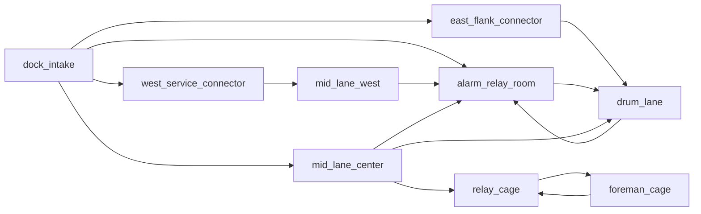

# B01 — Loading Dock (gold spec)

**Code:** [`CAMPAIGN_ENCOUNTERS[1]`](../../src/campaignEncounters.js) · **3D source:** [`art_src/levels/b01_loading_dock_designed.blend`](../../art_src/levels/b01_loading_dock_designed.blend) · **Runtime export:** [`public/assets/levels/b01_loading_dock_designed.glb`](../../public/assets/levels/b01_loading_dock_designed.glb) · **Matrix:** wide-flat + catwalk, spine → pinch → atrium (cage), relay / foreman signature.

## 1. Logline

Clear a mob logistics dock: three-lane read, relay hack under pressure, finish in the loading cage under catwalk overwatch.

## 2. Three-second read

Cold sodium on containers, **alarm amber** on the west relay volume, **catwalk glass** over the back cage; exit pressure reads **north / −Z** through the cage arch.

## 3. Route topology map

**Space ids (nodes):** `dock_intake`, `west_service_connector`, `east_flank_connector`, `mid_lane_center`, `mid_lane_west`, `alarm_relay_room`, `drum_lane`, `relay_cage`, `foreman_cage`.

**Mandatory spine:** `dock_intake` → `mid_lane_center` → `relay_cage` (see `primaryRoutes` on floorplan spaces).

**Zone doors:** `dock_to_mid_center` (`zone0` → opens on front zone clear).

## 4. Beat timeline map

| T | Zone | Verb | Composition | Geometry dependency |
|---|------|------|-------------|----------------------|
| 1 | 0 | read / pick_route | lookout FE, patrol FC, anchor FW | three-lane intake + threshold strip |
| 2 | 1 | push / hold | spine doorline FC; relay anchor MW; drum flank ME | relay partition offset door |
| 3 | 1 | hold + alarm | relay desk + `alarm_panel`; reinforcement pair | `alarm_interact_lane`, spawn door FE |
| 4 | 2 | clear high / clear | cage trio BC; reachable foreman-overlook scout BE | cage vestibule, side-overlook access strip, catwalk sightline |

## 5. Encounter graph

- **Transit:** `b01_entry_vestibule`, `b01_service_hall`, `b01_cage_vestibule` (no combat completion).
- **Combat:** `b01_intake_peek_clear` → `b01_relay_approach_clear` → `b01_alarm_relay` (reinforce `b01_alarm_pair` @ 8s alarm) → `b01_drum_flank_clear` → `b01_relay_cage_clear`.
- **Director:** flow-room gates; `hold_interact` `alarm_panel` completes `b01_alarm_relay`, clears `b01_alarm_pair`, and opens the drum flank.

## 6. Spatial grammar map

| Space / cell | Shape | Door language | Cover mix | Sightline |
|--------------|-------|---------------|-----------|-----------|
| FW / FE / FC intake | pocket + spine threshold | public threshold | knee apron + chest stacks | office_to_mid, center_to_relay |
| MW wedge | pinch | service | partition edge | — |
| MW relay | pocket + objective | hard offset | desk + manifest | office_to_mid, relay_peek_me |
| ME drum | spine flank | service | drum + crates | — |
| BC cage | atrium signature | hard vestibule | pillars + vestibule | catwalk_over_bc |
| BE foreman overlook | reachable side perch | double door-gap + access strip | desk rail / mullion / south rail | foreman_to_relay_cage |

## 7. Audio / lighting identity

`lightingMood` per room in encounter def; dock cold vs alarm amber vs cage high contrast. Reverb uses building campaign preset in runtime.

## 8. Mastery / setpiece

Mastery **`dock_no_alarm`**: avoid triggering alarm reinforcements (squad id `b01_alarm_pair` on building 1).

## 9. Acceptance checklist

See template; B01 is reference bar — all items satisfied in shipped build.

## 10. Authored 3D Level Pass

The B01 playable layout is now authored as a deterministic Blender map and mirrored into runtime collision/cover by `applyB01DesignedDockLevel()` in [`src/levelSequences.js`](../../src/levelSequences.js). The Blender source is organized into production-facing collections:

- `01_authored_walls_collision`: room shells, thresholds, compression walls, gate returns.
- `02_cover_and_landmarks`: player cover, enemy cover, objective desk, cage landmarks.
- `03_route_readability_and_previews`: route strips, preview glass, cage bars, overhead beams, floor labels.
- `04_lights_and_camera`: top-down design camera and mood lights.

The authored route is intentionally linear-readable, not random: safe vestibule -> first peek -> recovery dogleg -> relay threshold -> alarm office -> drum flank pressure -> cage vestibule -> signature cage with reachable foreman overlook -> exit. Each room owns a specific gameplay sentence, sightline budget, and visual language cue.

## 11. Traceability table

| Room / geometry | Runtime authoring source | `floorplan.spaces` |
|-----------------|--------------------------------------|--------------------|
| `dock_threshold_strip` | Blender source + `applyB01DesignedDockLevel()` | `dock_intake` |
| `west_service_run` | Blender source + `applyB01DesignedDockLevel()` | `west_service_connector` |
| `east_compression_corridor` | Blender source + `applyB01DesignedDockLevel()` | `east_flank_connector` |
| Relay partitions / panel / alarm lane | Blender source + `applyB01DesignedDockLevel()` | `alarm_relay_room` |
| `mid_spine_pinch` | Blender source + `applyB01DesignedDockLevel()` | `mid_lane_center` |
| `cage_vestibule` | Blender source + `applyB01DesignedDockLevel()` | `relay_cage` |
| Foreman glass / cage walls | Blender source + `applyB01DesignedDockLevel()` | `foreman_cage` |

<!-- ROOM_FLOW_REWORK_PACKET_START -->

## Room-Flow Rework Packet

**Runtime source:** `CAMPAIGN_ROOM_FLOWS[1]` in `src/campaignRoomFlows.js`.

**Baseline / failure note:** Before this rework the campaign shell behaved like an open zone arena: macro zone doors and broad zone spawns could make the waypoint favor a far door, the HUD read `ROOMS 0 / 3`, and future-room hostiles could participate before the player had crossed authored thresholds. This packet replaces that with flow-room gates, room-local encounters, and `ROOM n / 8` progress.

**Top-down critical path:** Spawn vestibule -> Intake peek room -> West service hall / east flank preview -> Relay approach -> Alarm relay office -> Drum flank pressure -> Cage vestibule -> Relay cage signature room -> Exit cage door.

**Flow identity:** service vestibule -> intake peek -> relay office -> cage.

**Pacing curve:** safe_orientation -> first_contact -> recovery_connector -> tension_build -> objective_pressure -> flank_complication -> anticipation -> signature_escalation.

**Deploy acceptance:** active start roster is b01_scout_fe_lane (lookout, b01_intake_peek); the first locked internal gate is b01_intake_to_service and is authored within the 8-12m deploy target.

### Room Beat List

| # | Room | Kind | Pacing | Gameplay purpose | Readability cue |
|---|------|------|--------|------------------|-----------------|
| 1 | Spawn vestibule | entry_room | safe_orientation | Orient safely and teach the single primary threshold. | One warm dock-threshold light and hazard stripe pull the player off spawn. |
| 2 | Intake peek room | peek_room | first_contact | Deliver the first deliberate peek contact without exposing the rest of the level. | A lookout silhouette is visible through a partial intake angle, with safe cover one step left. |
| 3 | West service hall / east flank preview | connector_hall | recovery_connector | Provide a short recovery dogleg and controlled side preview. | Cool service strip compresses movement and previews the relay glow through glass. |
| 4 | Relay approach | threshold_room | tension_build | Build tension at the office threshold with one held angle. | Amber desk light and the alarm-panel glow dominate the next threshold. |
| 5 | Alarm relay office | objective_room | objective_pressure | Force the player to clear the desk before holding the alarm relay. | The relay console is readable before entry but only safe after the desk anchor drops. |
| 6 | Drum flank pressure | flank_room | flank_complication | Wake a side-loop flanker after the relay beat so the room reconnects under pressure. | Red drums and a return-loop shadow mark the flanker route back toward the relay. |
| 7 | Cage vestibule | threshold_room | anticipation | Create a quiet pre-read of the final cage. | Rails and glass show the heavy in fragments before full commitment. |
| 8 | Relay cage signature room | signature_room | signature_escalation | Escalate into the multi-angle final fight: center cover, west pressure, east foreman overlook, then exit. | The cage landmark opens into a wider fight with a reachable side-overlook and a centered exit read. |

### Combat Choreography

| Room | First contact | Player cover answer | Enemy reaction | Exit reveal |
|------|---------------|---------------------|----------------|-------------|
| Intake peek room | Lookout appears at the partial doorway read before the player can see deeper rooms. | Spawn-side jamb or low apron immediately left of the threshold. | Peek from cover, then alarm only the adjacent approach. | Hazard stripe and gate light pull toward the connector. |
| Alarm relay office | Objective anchor guards the interact lane. | Offset partition edge and objective desk. | Guard objective until cleared. | Side-loop marker and changed relay light point to the flank room. |
| Drum flank pressure | Flanker crosses the side pocket after relay contact. | Drum stack / service-jamb cover. | Flank after contact and try to reconnect behind glass. | Final threshold light becomes visible through the connector. |
| Relay cage signature room | Signature heavy is previewed before the player commits through the final threshold. | Threshold face, first interior pillar, and the east-overlook access strip. | Heavy is glimpsed through cage rails before the reachable foreman-overlook sniper joins the commitment. | Back-lit exit threshold is exposed behind the final room. |

### Gate / Lock Plan

| Gate | From | To | Start | Opens on | Mesh id |
|------|------|----|-------|----------|---------|
| Intake threshold | b01_entry_vestibule | b01_intake_peek | threshold/open | enter b01_entry_vestibule | b01_entry_to_intake_gate |
| First internal gate | b01_intake_peek | b01_service_hall | locked | clear b01_intake_peek_clear | b01_intake_to_service_gate |
| Service threshold | b01_service_hall | b01_relay_approach | threshold/open | enter b01_service_hall | b01_service_to_relay_gate |
| Relay office gate | b01_relay_approach | b01_alarm_relay | locked | clear b01_relay_approach_clear | b01_relay_to_alarm_gate |
| Flank pressure gate | b01_alarm_relay | b01_drum_flank | locked | complete disable_alarm_panel | b01_alarm_to_drum_gate |
| Final threshold gate | b01_drum_flank | b01_cage_vestibule | locked | clear b01_drum_flank_clear | b01_drum_to_cage_gate |
| Cage vestibule threshold | b01_cage_vestibule | b01_relay_cage | threshold/open | enter b01_cage_vestibule | b01_cage_to_signature_gate |
| Exit door | b01_relay_cage | b01_exit_door | locked | clear b01_relay_cage_clear | b01_signature_to_exit_gate |

### Enemy Role Placement

| Room | Encounter | Roles / behavior / cover |
|------|-----------|--------------------------|
| Intake peek room | b01_intake_peek_clear | b01_scout_fe_lane:lookout/peek_from_cover@intake_apron |
| Relay approach | b01_relay_approach_clear | b01_fc_doorline:anchor/hold_angle@relay-east-hold |
| Alarm relay office | b01_alarm_relay | b01_mw_desk:anchor/guard_objective@relay_desk |
| Drum flank pressure | b01_drum_flank_clear | b01_me_lane:flanker/flank_after_contact@drum_spool |
| Relay cage signature room | b01_relay_cage_clear | b01_bw_hold:patrol/suppress_lane@cage_pillar_west; b01_bc_heavy:anchor/hold_angle@cage_center_low; b01_bc_rifle:patrol/peek_from_cover@vestibule_face; b01_be_scout:sniper/overwatch_catwalk@desk_rail in the reachable foreman overlook |

### Sightline And Negative-Space Fixes

- Spawn sightlines are capped by the entry threshold and first peek room visibility budget. Future-room enemies are dormant until the room graph activates them.
- The former sealed foreman pocket is now connected by two authored door gaps and an access strip; the final sniper is inside `b01_relay_cage` bounds and reachable from the cage floor.
- Locked room gates break the old open-square solve pattern; the waypoint targets the active room gate/objective before macro zone doors.
- Large floor patches are assigned to named purposes: connector recovery, objective pressure, side-loop flank, anticipation threshold, or signature escalation.
- Preview reads are deliberate: peek-room silhouette, objective/relay glass, final-threshold rails or glass, and signature-room landmark lighting.

<!-- ROOM_FLOW_REWORK_PACKET_END -->
