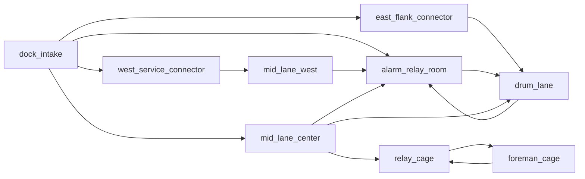

# B01 — Loading Dock (gold spec)

**Code:** [`CAMPAIGN_ENCOUNTERS[1]`](../../src/campaignEncounters.js) · **Matrix:** wide-flat + catwalk, spine → pinch → atrium (cage), relay / foreman signature.

## 1. Logline

Clear a mob logistics dock: three-lane read, relay hack under pressure, finish in the loading cage under catwalk overwatch.

## 2. Three-second read

Cold sodium on containers, **alarm amber** on the west relay volume, **catwalk glass** over the back cage; exit pressure reads **north / −Z** through the cage arch.

## 3. Route topology map

**Space ids (nodes):** `dock_intake`, `west_service_connector`, `east_flank_connector`, `mid_lane_center`, `mid_lane_west`, `alarm_relay_room`, `drum_lane`, `relay_cage`, `foreman_cage`.

**Mandatory spine:** `dock_intake` → `mid_lane_center` → `relay_cage` (see `primaryRoutes` on floorplan spaces).

**Zone doors:** `dock_to_mid_center` (`zone0` → opens on front zone clear).

## 4. Beat timeline map

| T | Zone | Verb | Composition | Geometry dependency |
|---|------|------|-------------|----------------------|
| 1 | 0 | read / pick_route | lookout FE, patrol FC, anchor FW | three-lane intake + threshold strip |
| 2 | 1 | push / hold | spine doorline FC; relay anchor MW; drum flank ME | relay partition offset door |
| 3 | 1 | hold + alarm | relay desk + `alarm_panel`; reinforcement pair | `alarm_interact_lane`, spawn door FE |
| 4 | 2 | clear high / clear | cage trio BC; catwalk scout BE | cage vestibule, catwalk sightline |

## 5. Encounter graph

- **Transit:** `b01_west_service`, `b01_east_flank`, `b01_mid_west_wedge` (no combat completion).
- **Combat:** `b01_dock_intake` → `b01_mid_spine` → `b01_alarm_relay` (reinforce `b01_alarm_pair` @ 8s alarm) → `b01_drum_flank` → `b01_relay_cage` → `b01_foreman_read`.
- **Director:** `traverse_room` `mid_lane_center`; `hold_interact` `alarm_panel` completes `b01_alarm_relay`, clears `b01_alarm_pair`.

## 6. Spatial grammar map

| Space / cell | Shape | Door language | Cover mix | Sightline |
|--------------|-------|---------------|-----------|-----------|
| FW / FE / FC intake | pocket + spine threshold | public threshold | knee apron + chest stacks | office_to_mid, center_to_relay |
| MW wedge | pinch | service | partition edge | — |
| MW relay | pocket + objective | hard offset | desk + manifest | office_to_mid, relay_peek_me |
| ME drum | spine flank | service | drum + crates | — |
| BC cage | atrium signature | hard vestibule | pillars + vestibule | catwalk_over_bc |
| BE foreman | pocket overwatch | glass read | desk rail / mullion | foreman_to_relay_cage |

## 7. Audio / lighting identity

`lightingMood` per room in encounter def; dock cold vs alarm amber vs cage high contrast. Reverb uses building campaign preset in runtime.

## 8. Mastery / setpiece

Mastery **`dock_no_alarm`**: avoid triggering alarm reinforcements (squad id `b01_alarm_pair` on building 1).

## 9. Acceptance checklist

See template; B01 is reference bar — all items satisfied in shipped build.

## 10. Traceability table

| Room / geometry | `EXTRA_ELEMENTS[1]` / `SEQUENCE_DEFS` | `floorplan.spaces` |
|-----------------|--------------------------------------|--------------------|
| `dock_threshold_strip` | EXTRA | `dock_intake` |
| `west_service_run` | EXTRA | `west_service_connector` |
| `east_compression_corridor` | EXTRA | `east_flank_connector` |
| Relay partitions / panel / alarm lane | EXTRA | `alarm_relay_room` |
| `mid_spine_pinch` | EXTRA | `mid_lane_center` |
| `cage_vestibule` | EXTRA | `relay_cage` |
| Foreman glass / cage walls | EXTRA | `foreman_cage` |
