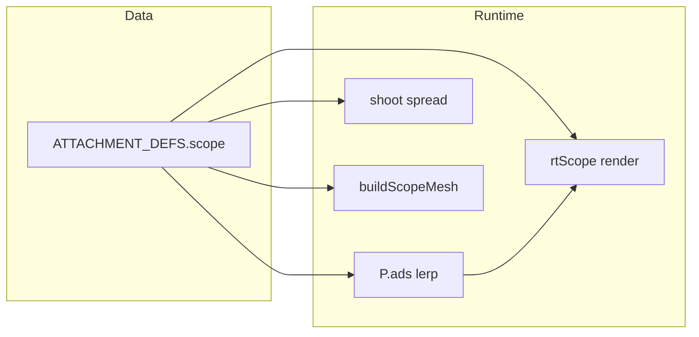

# Scoped optics attachments — enhancement plan

**Terminology:** In this repo, “scoped attachments” maps to the **`scope` slot** in `ATTACHMENT_DEFS` (iron RDS → prism RDS), the dynamic viewmodel group `m4ScopeGrp`, and the optional **PIP** (picture-in-picture) pass through `rtScope` / `scopeCamera`. This is **not** the same as renaming slots to `optic` (see future note in [GAMEPLAY_PLAN.md](GAMEPLAY_PLAN.md) ~lines 728–729).

---

## 0. Current architecture (source of truth)

| Concern | Location | Behavior |
|--------|----------|----------|
| Tier definitions | [`ATTACHMENT_DEFS.scope`](src/main.js) ~7013–7017 | `spreadMul`, `adsSpreadMul`, `adsSpeedMul`, cosmetic hex colors |
| 3D mesh build | `buildScopeMesh(att)` ~6059–6155 | Disposes previous children; reflex-style boxes + tilted glass + reticle planes + tier geo |
| Visibility | `refreshAttachmentVisuals()` ~6156–6158 | Scope mesh only when **`P.weaponIdx === 0`** (M4) |
| Spread in combat | `shoot()` ~8676–8702 | Uses `_scopeAtt.spreadMul` / `adsSpreadMul` **for any weapon** when equipped |
| ADS speed | Main loop ~16372 | `_adsSpeed` multiplied by `P.attachments.scope.adsSpeedMul` when scope exists |
| PIP render | ~17107–17128 | Extra `renderer.render(scene, scopeCamera)` → `rtScope`; `scopeViewM_active.opacity` tied to `P.ads`; DOM `#scope-vignette` |
| PIP camera | ~6831–6833 | `PerspectiveCamera(28,1,...)`, `layers.set(0)` — **excludes layer 1 viewmodel** |
| Lens quad material | ~6099–6106 | `MeshBasicMaterial` with `map: rtScope.texture`; opacity 0 until ADS |
| ADS visual scale | `updateGunAnim` / gun tick ~16207–16217 | `m4ScopeGrp` scale/position from `P.ads` and tier |
| UI — wrist holo | `_drawWristCanvas` ~8101–8135 | SCOPE row shows stats assuming scope-shaped fields |
| UI — pause loadout | `showLoadoutViewer` ~12972–12977 | Text list includes scope |

**Important inconsistency (document for implementers):** `attachmentScore()` ~7039–7041 uses `spreadMul`, `adsSpreadMul`, `adsSpeedMul` for **all** attachment types. Mag/muzzle/foregrip entries omit some fields → **NaN scores** and meaningless BETTER/WORSE toasts when swapping non-scope pickups. Any agent touching scope UX should **fix scoring by `a.type`** (or default missing multipliers to `1`).

---

## 1. Functional enhancements (prioritized)

### P1 — Correctness and clarity

1. **`attachmentScore` / equip toast:** Branch on `a.type` or use safe defaults so mag/muzzle/foregrip comparisons show sensible deltas (e.g. damage, reload %, recoil %) instead of NaN.
2. **Document or unify weapon rules:** Today, **stat multipliers apply globally** while **3D optic + PIP are M4-only**. Either:
   - **Option A (minimal):** Add a code comment + loadout tooltip: “RDS model & lens view: M4 only; stats apply to all weapons.”
   - **Option B (full):** Extend `buildScopeMesh` or add `buildSideRailOptic` for other primary weapons that should show an optic (DMR/sniper), or gate **spread bonuses** to rifles only if design demands realism.

### P2 — Data-driven scope behavior

Replace magic numbers with fields on each scope tier (defaults preserved for balance tuning in one place):

| Constant today | Proposed field on scope def |
|----------------|-----------------------------|
| `scopeCamera.fov = 14 - tier*2` (~17116–17117) | `pipFov` or `zoomMul` derived from base |
| Tier weights in `m4ScopeGrp` scale (~16213–16216) | `adsScaleMul` |
| Reticle dot/halo sizes (~6109–6119) | `dotRadiusMul`, `haloRadiusMul` |
| Optional | `pipOpacityMax` (cap currently `.97`) |

### P3 — Reticle / optic variants

- Add `reticleShape: 'dot' | 'ring' | 'dotRing' | 'chevron'` (and optional `showBdc: false`) → branch geometry in `buildScopeMesh` instead of only plane + ring.
- Tier 4 “prism” could swap to a **slightly different glass silhouette** or secondary ghost ring for readability.

### P4 — Settings and accessibility

- **`SETTINGS.scopePipEnabled`** (default true): when false, skip `rtScope` pass and keep reticle-only ADS (CPU/GPU save).
- **`SETTINGS.scopePipResolution`** e.g. `512 | 1024 | 0` (0 = match internal scale): resize `rtScope` (already partially handled near ~7802–7804 on window resize — extend conceptually).
- **Colorblind presets:** map `dotColor` / `haloColor` through a small palette override table.

### P5 — Progression / pickups

- Ensure scope pickups and save/load (`attachments` snapshot ~14559–14575) stay in sync if new keys are added to defs.
- If adding achievements, extend `_collected` logic (~14520) to count scope tiers distinctly.

---

## 2. Visual and “feel” enhancements

### Viewmodel (Three.js)

1. **Lens readability:** Add a **thin dark bezel frame** on the glass plane edges (second plane or UV-less trim meshes) so the PIP read separates from the world.
2. **Glass:** Optional **fake Fresnel** — slightly brighten rim `emissive` based on view angle (shader not required initially: animate emissive in the same gun update block as ~16207).
3. **Tier differentiation:** Stronger silhouette breaks between T1–T4 (hood length, post thickness, LED color per tier using `att.dotColor`).
4. **Recoil coupling:** Subtle **reticle lag** or opposite kick (1–2 frames smoothed offset on `gReticle` local position) when `H.firePlaying` — sells weight without affecting actual raycasts.

### PIP / post

1. **Vignette:** Replace or layer `#scope-vignette` ([index.html](index.html) ~90) with tier-tinted inner ring (cyan for prism tier) via CSS variables set from JS when scope changes.
2. **Transition:** Short ease on PIP opacity (avoid instant pop at `P.ads > .05`).
3. **Composer interaction:** Verify `_composer.render()` path (~17129) still clears/displays `rtScope` texture correctly; if artifacts appear, document render order (PIP must update **before** final composer pass).

### UI

1. **Wrist holo scope row:** Mini schematic icon (canvas paths) or tier-colored **optic silhouette** beside text — mirrors gun mesh flavor.
2. **Stat strings:** Show **effective zoom** (derived from `pipFov` vs main camera FOV) so players understand tier value beyond abstract percentages.

### Audio (optional)

- Distinct **equip blip** pitch per tier; faint **ADS plastic click** when crossing `ads > 0.5`.

---

## 3. Performance guidelines

- **Cost:** One extra full-scene render per frame while ADS + scope + M4 (~17119–17121). Mitigations:
  - Skip PIP on odd frames at low FPS (threshold e.g. `PERF.emaFps < 45`).
  - Reduce `rtScope` resolution when `P.ads < 0.85`.
- **Memory:** `buildScopeMesh` already disposes geometries/materials — preserve that pattern when adding meshes.

---

## 4. Acceptance criteria (agent checklist)

- [ ] Equipping/swapping scopes still updates `refreshAttachmentVisuals()` and does not leak GPU resources (`dispose` on rebuild).
- [ ] Shooting spread matches `_weaponSpreadMul` + scope multipliers; ADS speed reflects `adsSpeedMul`.
- [ ] PIP shows world-only (no floating gun/hands); opacity tracks ADS; vignette resets when exiting ADS.
- [ ] Non-scope attachment equip toasts show **numeric**, non-NaN comparisons after `attachmentScore` fix.
- [ ] `npm run dev` (or project’s standard script): no console errors; scope visible on M4 with attachment equipped.

---

## 5. Suggested implementation order for an agent

1. Fix **`attachmentScore`** and wrist/loadout stat labels for type-specific stats (quick win, reduces confusion).
2. Introduce **data fields** on `ATTACHMENT_DEFS.scope` and replace magic numbers in PIP FOV + ADS scale + reticle sizes.
3. **Visual pass:** bezel + tier silhouette tweaks + PIP opacity easing + optional vignette tint.
4. **SETTINGS** toggles and resolution tier for PIP.
5. **Reticle variants** (if time): `reticleShape` branching in `buildScopeMesh`.
6. **Cross-weapon optics** (optional large scope): only after design choice between Options A/B in §P1.

---

## 6. Files likely touched

- [src/main.js](src/main.js) — primary implementation surface (~6059–6158, ~6827–6834, ~7010–7042, ~8100–8140, ~8676–8702, ~12963–12994, ~16360–16375, ~16207–16217, ~17107–17128, ~7800–7806 if resize logic exists).
- [index.html](index.html) — `#scope-vignette` CSS or related HUD.
- Settings persistence (search `SETTINGS` initialization in `main.js` or companion module) if adding toggles.

---

## 7. Out of scope / defer

- Renaming `scope` → `optic` across saves and UI ([GAMEPLAY_PLAN.md](GAMEPLAY_PLAN.md) migration note) — separate refactor PR unless bundled intentionally.
- Full shader-based scope distortion — mark as stretch goal behind a feature flag.
